# Aside: Model Skill and Cross Validation {- .aside-chapter}

```{r, echo=FALSE}
set.seed(2613)
```

## Why This Matters

Fitting a model and evaluating a model are not the same thing. When you fit a model on a dataset and then evaluate it on that same dataset, you are not measuring how well the model predicts. You are measuring how well it memorizes.

A model can have a high $R^2$, low residuals, and an impressive-looking summary table, and still be nearly useless for prediction. This happens when the model has learned the noise in your data along with the signal, a problem called **overfitting**. Overfit models describe your observed data well but generalize poorly to new data. The inverse is also a problem: a model that is too simple to capture the real structure in the data, called **underfitting**, will perform badly both in-sample and out-of-sample, though in a more obvious way.

**Model skill** is a term used to describe a model's ability to make accurate predictions on data it was not trained on. The metrics we'll develop here, $R^2$, RMSE, and MAE, are just numbers. What matters is whether they are computed on data the model was trained on (in-sample) or on data the model has never seen (out-of-sample). The second kind is model skill. This chapter is about how to measure it.

## Packages

```{r, message=FALSE}
library(tidyverse)
library(sf)
library(gstat)
library(PNWColors)
```

We'll also mention the `caret` package [@R-caret] toward the end of this chapter. It is the standard workhorse for cross validation in R, but it has its own syntax that takes some getting used to. For now we will build things by hand so the mechanics are clear.

```{r, echo=FALSE}
anem7 <- pnw_palette(name="Anemone", n=7, type="discrete")
```

## Measuring Skill

### The Observed-vs-Predicted Plot

Before we get to numbers, let's talk about a plot. The most informative single diagnostic for model skill is a scatter plot with observed values on the x-axis and predicted values on the y-axis. A perfect model puts every point exactly on the 1:1 line, that is, the line with slope 1 and intercept 0. Points above the line mean the model is overpredicting. Points below mean it is underpredicting. How tightly the cloud clusters around the 1:1 line tells you about the overall accuracy of the predictions.

 

Get in the habit of making this plot whenever you make a model. Summary statistics like those below are useful but they can mislead you in ways this plot makes immediately obvious. A model with a strong systematic bias, where it consistently predicts twice the true value for instance, can produce a respectable-looking $R^2$ depending on how you compute it. The classic example of this is [Anscombe's quartet](https://en.wikipedia.org/wiki/Anscombe%27s_quartet), a set of four datasets constructed to make exactly this point: identical summary statistics can arise from completely different underlying structures, and the numbers alone will never tell you which one you have. Anscombe built it in 1973 specifically to push back against the then-common attitude that plots were unnecessary once you had the statistics. The observed-vs-predicted plot reveals that kind of problem at a glance. We will see many examples of it in the interpolation chapters.

### $R^2$

You already know $R^2$ from linear regression, where it is defined as:

$$R^2 = 1 - \frac{SS_{res}}{SS_{tot}} = 1 - \frac{\sum_{i=1}^n (y_i - \hat{y}_i)^2}{\sum_{i=1}^n (y_i - \bar{y})^2}$$

where $y_i$ is the observed value, $\hat{y}_i$ is the predicted value, and $\bar{y}$ is the mean of the observed values. An $R^2$ of 1 means the model explains all of the variance in $y$. An $R^2$ of 0 means the model does no better than predicting $\bar{y}$ for every observation. This is the version reported in `summary(lm(...))`.

When we evaluate skill on withheld data, we will typically compute $R^2$ as the squared Pearson correlation between observed and predicted values:

$$R^2 = \left[\text{cor}(y, \hat{y})\right]^2$$

This is equivalent to the formula above for in-sample linear model predictions, but not in general. The correlation-based version is always between 0 and 1, because squaring a correlation removes the sign. The formula-based version applied to test data can actually go negative if your model's predictions are worse than just using the mean everywhere. That is not a math error, it means the model is that bad. In this course we will use the correlation-based version:

```r
rsq <- cor(obs, preds)^2
```

and pair it with the observed-vs-predicted plot so that systematic biases do not hide behind a number that looks acceptable.

### RMSE and MAE

Both RMSE and MAE measure the average prediction error in the same units as $y$, and lower is better for both. They measure slightly different things though, and the difference is worth understanding.

$$RMSE = \sqrt{\frac{\sum_{i=1}^n (\hat{y}_i - y_i)^2}{n}} \qquad\qquad MAE = \frac{\sum_{i=1}^n |\hat{y}_i - y_i|}{n}$$

RMSE squares each error before averaging, then takes the square root to return to the original units. MAE takes the absolute value of each error and averages those directly. The consequence is that RMSE penalizes large errors disproportionately. A prediction that's off by 10 contributes 100 to the RMSE sum. A prediction that's off by 1 contributes 1. So the big error has 100 times the influence, not 10 times. Under MAE, a prediction off by 10 contributes 10 and one off by 1 contributes 1, so the big error is only 10 times as influential.

In practice this means RMSE is more sensitive to outliers than MAE. If your model makes mostly small errors but occasionally produces a very wrong prediction, RMSE will show that more dramatically than MAE will. There is a useful side effect here: if RMSE is substantially larger than MAE on the same predictions, that is a signal your error distribution has a long tail, meaning a few predictions are quite a lot worse than the rest. When RMSE and MAE are close to each other your errors are more uniformly distributed. RMSE is always greater than or equal to MAE for the same set of predictions. They are equal only when every error is exactly the same size, which never happens in practice.

Statisticians argue about which to use with some dedication. I'm happy to let them [fight about it](https://stats.stackexchange.com/questions/48267/mean-absolute-error-or-root-mean-squared-error). I prefer MAE because it's simpler to interpret. RMSE is more standard in many subfields, including geostatistics, so you should be comfortable computing and interpreting both.

```r
rmse <- sqrt(mean((preds - obs)^2))
mae  <- mean(abs(preds - obs))
```

## The Problem with In-Sample Statistics

Let's make the overfitting problem concrete. We will simulate some data where we know the true relationship, hold out a chunk of it as a test set, and then fit polynomial models of increasing complexity. For each model we'll track in-sample and out-of-sample $R^2$ as flexibility grows.

```{r}
n   <- 50
x   <- runif(n, min=-4, max=4)
eps <- rnorm(n, sd=15)
y   <- 30 + 2*x^3 - 5*x + eps
dat <- data.frame(x=x, y=y)
```

We have `r n` observations with one predictor $x$ and response $y$. The true relationship is $y = 30 + 2x^3 - 5x + \varepsilon$ but we don't know that when fitting.

```{r}
ggplot(dat, aes(x=x, y=y)) +
  geom_point(size=2.5, alpha=0.8) +
  theme_minimal()
```

Let's hold out 1/3 of the points as a test set, then on the training data fit polynomial models of degree 1 through 10. For each one we'll compute in-sample $R^2$ on the training data and out-of-sample $R^2$ on the test data.

```{r}
test_ov_idx <- sample(1:nrow(dat), size=round(nrow(dat) * 0.33))
train_ov    <- dat[-test_ov_idx, ]
test_ov     <- dat[test_ov_idx,  ]

degrees <- 1:10
rsq_in  <- numeric(length(degrees))
rsq_out <- numeric(length(degrees))

for(d in degrees){
  fit_d      <- lm(y ~ poly(x, d), data=train_ov)
  rsq_in[d]  <- cor(train_ov$y, predict(fit_d))^2
  rsq_out[d] <- cor(test_ov$y,  predict(fit_d, newdata=test_ov))^2
}

bv <- data.frame(
  degree = rep(degrees, 2),
  rsq    = c(rsq_in, rsq_out),
  set    = rep(c("Training", "Test"), each=length(degrees))
)

ggplot(bv, aes(x=degree, y=rsq, color=set)) +
  geom_line(linewidth=1.1) +
  geom_point(size=2.5) +
  scale_x_continuous(breaks=degrees) +
  scale_color_manual(values=c(anem7[7], anem7[1])) +
  labs(x="Polynomial degree", y=bquote(R^2), color=NULL) +
  theme_minimal()
```

Training $R^2$ climbs as we add flexibility because more parameters always reduce in-sample residuals. Out-of-sample $R^2$ peaks somewhere around the true cubic relationship and then starts to fall off as the model begins chasing noise rather than signal. The two curves tell completely different stories about model quality. If you only looked at the training curve you would conclude the most complex model wins every time.

That gap between the training and test curves is overfitting. And the lesson is not to pick the model that maximizes in-sample $R^2$. It is to pick the one that does well on data it has not seen.

## Train/Test Holdout

What we just did is the simplest form of skill assessment: split the data into a **training** set and a **test** set, fit on the training data only, and evaluate on the test data. The test set acts as a stand-in for data the model has never seen.

There is no universal rule for the split ratio. The historical advice was 2/3 training and 1/3 testing. You'll also see 70/30 and 80/20. With small datasets, giving up a third of your data for testing means you're training on less than you'd like. With large datasets it matters less. 

```{r}
test_idx            <- sample(1:nrow(dat), size=round(nrow(dat) * 0.25))
dat$split           <- "train"
dat$split[test_idx] <- "test"

ggplot(dat, aes(x=x, y=y, color=split)) +
  geom_point(size=3) +
  scale_color_manual(values=c(anem7[1], anem7[7])) +
  theme_minimal()
```

```{r}
train     <- dat[dat$split == "train", ]
test      <- dat[dat$split == "test",  ]

fit       <- lm(y ~ poly(x, 3), data=train)
test$yhat <- predict(fit, newdata=test)

rsq  <- cor(test$y, test$yhat)^2
rmse <- sqrt(mean((test$yhat - test$y)^2))
mae  <- mean(abs(test$yhat - test$y))

c("rsq"=rsq,"rmse"=rmse,"mae"=mae)
```

```{r}
ggplot(test, aes(x=y, y=yhat)) +
  geom_abline(slope=1, intercept=0, linetype="dashed") +
  geom_point(size=3, color=anem7[7]) +
  coord_fixed(xlim=range(test$y, test$yhat),
              ylim=range(test$y, test$yhat)) +
  labs(x="Observed", y="Predicted") +
  theme_minimal()
```

For the cubic model we get an out-of-sample $R^2$ = `r round(rsq, 3)`, RMSE = `r round(rmse, 2)`, and MAE = `r round(mae, 2)`, all computed on data the model never saw during fitting.

There is still a problem though. We ran one split and those numbers depend entirely on which observations happened to land in the test set. Run it again with a different seed and you'll get different numbers. From a single split, we can't say much about how stable those estimates are.

## The Null Model

Now that we have RMSE and MAE on the test data, we have numbers. But what do they mean? Knowing RMSE = `r round(rmse, 2)` doesn't tell you much on its own. Good or bad depends entirely on the scale and variability of whatever you're predicting. This is where the null model comes in.

The null model is the simplest prediction you could possibly make: ignore all your predictor information and predict $\bar{y}$ for every observation. No spatial structure, no covariates, nothing. Just the mean. The null RMSE is:

$$RMSE_{null} = \sqrt{\frac{\sum_{i=1}^n (\bar{y} - y_i)^2}{n}}$$

If you look at that carefully it is essentially the standard deviation of $y$ (with $n$ in the denominator rather than $n-1$). Any model worth using should beat this. If it can't outperform a model that ignores all the predictor information, it isn't providing anything useful.

From the null model you can compute a relative skill score:

$$\text{skill} = 1 - \frac{RMSE}{RMSE_{null}}$$

A skill of 0 means your model does no better than predicting the mean everywhere. A skill of 1 is a perfect model. Negative values are possible if your predictions are somehow worse than the null, which is a sign something has gone seriously wrong. This measure shows up in climate and atmospheric science under names like the Nash-Sutcliffe efficiency or the reduction of variance. It also maps directly onto the formula-based $R^2$ from linear regression: $R^2 = 0$ means your model does no better than the mean, which is exactly what the null model represents. The connection is not a coincidence.

The same logic applies to MAE: compute the null MAE using $\bar{y}$ as the prediction everywhere and compare your model's MAE against it.

One thing to be careful about: the null model should be built from the training data and applied to the test data, just like any other model. Use the mean of the training observations, not the mean of the test set or the full dataset. Using test data to define your baseline is the same kind of leakage as using it to fit your model.

```{r}
rmseNull <- sqrt(mean((mean(train$y) - test$y)^2))
maeNull  <- mean(abs(mean(train$y) - test$y))

rmseNull
1 - (rmse / rmseNull)
```

Our RMSE of `r round(rmse, 2)` against a null of `r round(rmseNull, 2)` gives a skill score of `r round(1 - rmse/rmseNull, 3)`. The model is doing good work relative to the null. The null model idea extends further than just picking a reference statistic. It forces you to ask: what is the simplest model that could plausibly describe this system, and can I beat it? In spatial prediction the null is usually the global training mean. In some applications you might use something more informative as the baseline, a spatial trend surface or a long-term climatological average for instance, and evaluate skill relative to that. The key is always having a sensible reference point so your metrics mean something beyond their raw value.

Students trained on hypothesis testing often want to know whether a skill score like `r round(1 - rmse/rmseNull, 3)` is "significant." The honest answer is that the question doesn't quite translate. A skill score of `r round(1 - rmse/rmseNull, 3)` means your model accounts for about half the variation that the null model misses, which is  meaningful, but whether it is good depends entirely on the problem. Predicting next-week precipitation across a mountain range with a skill of `r round(1 - rmse/rmseNull, 3)` might be impressive given the chaos of atmospheric dynamics. Getting a skill of `r round(1 - rmse/rmseNull, 3)` predicting the boiling point of water as a function of elevation would be embarrassing. You can in principle run a permutation test, shuffle your $y$ values, recompute skill scores many times, and ask where your observed score falls in that null distribution, but this is rarely done in practice and doesn't really answer the question practitioners care about. The more useful questions are: does the model perform well enough for the intended purpose, and can I build something that does better? A skill score is a number on a scale with a known floor (0 = no better than the mean) and a known ceiling (1 = perfect). Interpret it relative to those anchors, relative to what competing models achieve, and relative to the costs of being wrong in your application. That is more informative than a p-value would be.

## K-Fold Cross Validation

K-fold cross validation solves the single-split problem by repeating the train/test evaluation systematically across the whole dataset. The idea is to divide the data into $k$ roughly equal groups called **folds**. For each fold in turn, hold it out as the test set and train the model on the remaining $k-1$ folds. Evaluate skill on the held-out fold. Repeat for all $k$ folds and take the mean.

With $k=10$ you use 90% of the data for training in each iteration and 10% for testing, and every observation gets to be in the test set exactly once. The mean skill across folds is a much more stable estimate than any single train/test split.

```{r}
k    <- 10
dat2 <- dat[sample(nrow(dat)), c("x","y")]  # shuffle, drop the split column
dat2$fold <- cut(seq(1, nrow(dat2)), breaks=k, labels=FALSE)

results <- data.frame(fold=1:k, rsq=NA, rmse=NA, mae=NA)

for(i in 1:k){
  train_i <- dat2[dat2$fold != i, ]
  test_i  <- dat2[dat2$fold == i, ]
  
  fit_i  <- lm(y ~ poly(x, 3), data=train_i)
  yhat_i <- predict(fit_i, newdata=test_i)
  
  results$rsq[i]  <- cor(test_i$y, yhat_i)^2
  results$rmse[i] <- sqrt(mean((yhat_i - test_i$y)^2))
  results$mae[i]  <- mean(abs(yhat_i - test_i$y))
}

results
```

```{r}
colMeans(results[, c("rsq","rmse","mae")])
```

Now we have a distribution of skill estimates, not just one number. Let's look at it.

```{r}
results %>%
  pivot_longer(cols=c(rsq, rmse, mae),
               names_to="metric", values_to="value") %>%
  ggplot(aes(x=value)) +
  geom_histogram(bins=6, fill=anem7[5], color=anem7[7]) +
  labs(x=NULL, y=NULL) +
  facet_wrap(~metric, scales="free_x") +
  theme_minimal()
```

The spread across folds is the variability in predictive performance conditional on this dataset and this model. A tight distribution means the mean is a reliable estimate. A wide one tells you a single split could easily have given you something misleading. The cross-validated mean is the number to report, not the in-sample $R^2$ from `summary(lm(...))`.

One natural question is whether $k=10$ is the right choice. With larger $k$ you train on more data each time, which can help with small datasets. The extreme is **leave-one-out cross validation** (LOOCV), where $k=n$ and each test set has exactly one observation. LOOCV has low bias but can be computationally expensive and tends to produce noisy skill estimates. For most purposes $k=5$ or $k=10$ is a reasonable default.

A brief note on **repeated k-fold**: with small datasets, the k-fold estimates themselves can vary from run to run because the fold assignments are random. Repeated k-fold runs the whole procedure multiple times with different random assignments and averages across all of them, giving you an interval estimate rather than a point estimate. The `caret` package handles this with `trainControl(method="repeatedcv", number=10, repeats=10)`. If you take the machine learning module you will work through that in detail. The structure is identical to what we built above, just automated and repeated.

## The Spatial Problem

Everything above assumes that randomly splitting your data into training and test sets gives you a legitimate evaluation. With spatial data, that assumption runs into trouble.

Spatial autocorrelation means observations close together tend to have similar values. If you hold out a random 25% of your spatial data as a test set, most of those withheld points will have autocorrelated neighbors sitting in the training set. The model has access to spatially correlated information near every test point, which makes predicting those points easier than predicting locations in truly new areas. Your skill metrics end up looking better than they should.

Let's look at what a random holdout actually looks like on the Meuse floodplain dataset we'll use in the interpolation chapters.

```{r, message=FALSE}
data(meuse.all)
meuse_sf <- st_as_sf(meuse.all, coords=c("x","y"), crs=28992)

test_m_idx                 <- sample(1:nrow(meuse_sf), size=round(nrow(meuse_sf) * 0.25))
meuse_sf$split             <- "train"
meuse_sf$split[test_m_idx] <- "test"

ggplot(meuse_sf) +
  geom_sf(aes(color=split, shape=split), size=3) +
  scale_color_manual(values=c(anem7[1], anem7[7])) +
  theme_minimal() +
  labs(title="Random 75/25 holdout",
       subtitle="Test points scattered among training points")
```

Look at where the test points land. Nearly every one of them is surrounded by training points. When you predict lead concentration at a withheld location that has three or four neighbors in the training set within 50 meters, you are not testing how well the model predicts in unknown space. You are testing it on locations well surrounded by known ones, which is a much easier task.

The more principled alternative is to hold out spatially contiguous **blocks** rather than randomly scattered points. If you hold out an entire region, the model has to extrapolate into that region rather than interpolate between nearby training points. This is called **spatial block cross validation** and the `blockCV` and `spatialsample` packages implement it. We won't go into the details here, but it is the right approach if you need predictions to generalize to new areas beyond your sampling domain.

For the interpolation methods in this course, IDW and kriging, the standard approach is **leave-one-out cross validation** (LOOCV). Remove one observation, predict it from all the remaining observations, and repeat for every point. The `gstat` function `krige.cv()` implements this directly and we'll use it in the kriging chapter. LOOCV is better than a single random split because every observation gets to be a test point, but it does not fully solve the spatial dependence problem. The left-out point still has autocorrelated neighbors in the training data. In geostatistics it is the accepted standard, and it is what we will use here, with that caveat in mind.

## A Note on Interpolation

In the interpolation chapters that follow, starting with inverse distance weighting, you will build spatial prediction models and assess their skill. The workflow is: fit the model on a training set, predict to withheld locations, compute $R^2$, RMSE, and MAE on those withheld predictions, and examine the observed-vs-predicted plot. That is exactly what this chapter has been building toward.

When the skill metrics drop once you switch from in-sample to out-of-sample evaluation, that is not a mistake or a sign something went wrong. That is model skill, measured carefully.
