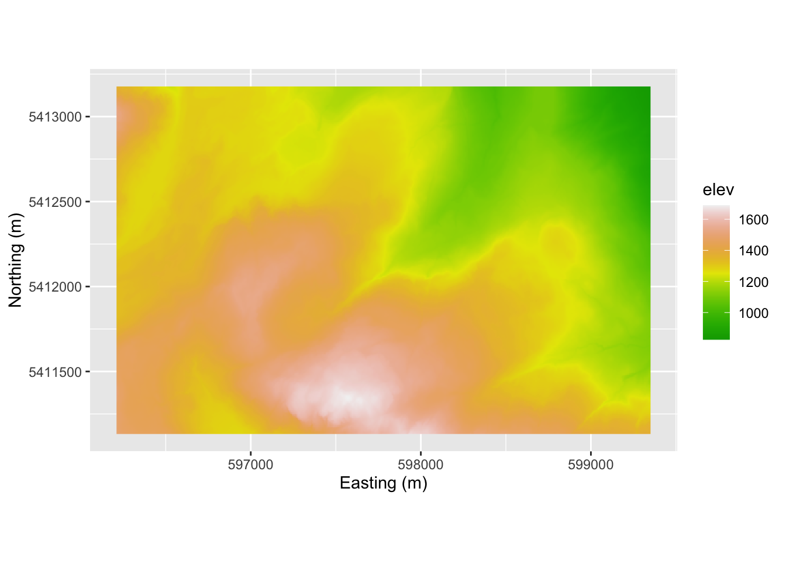
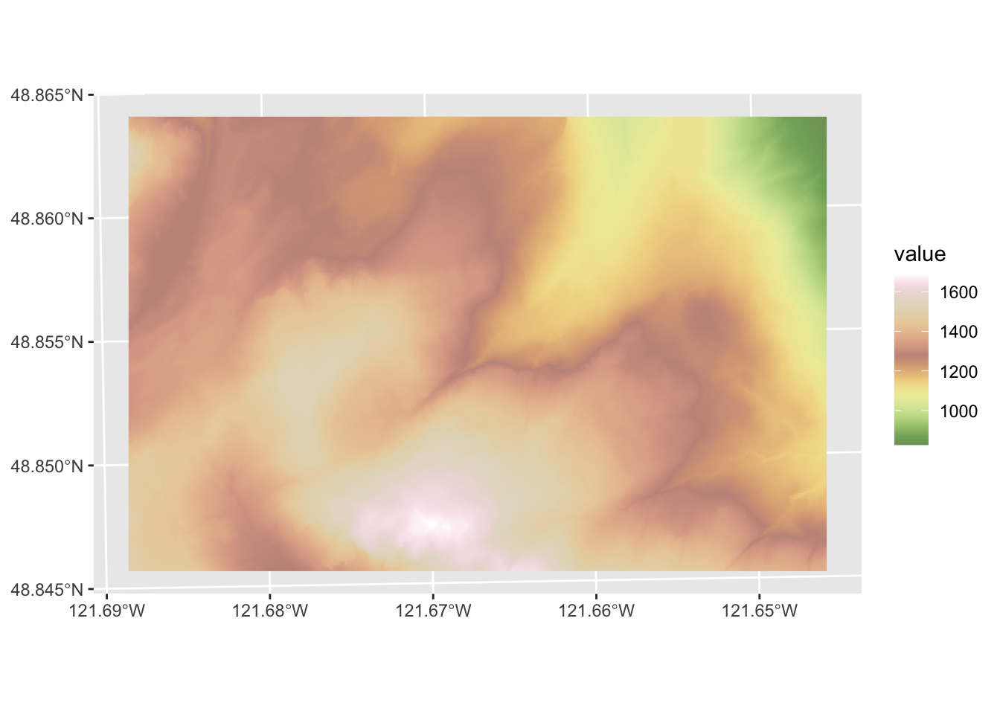
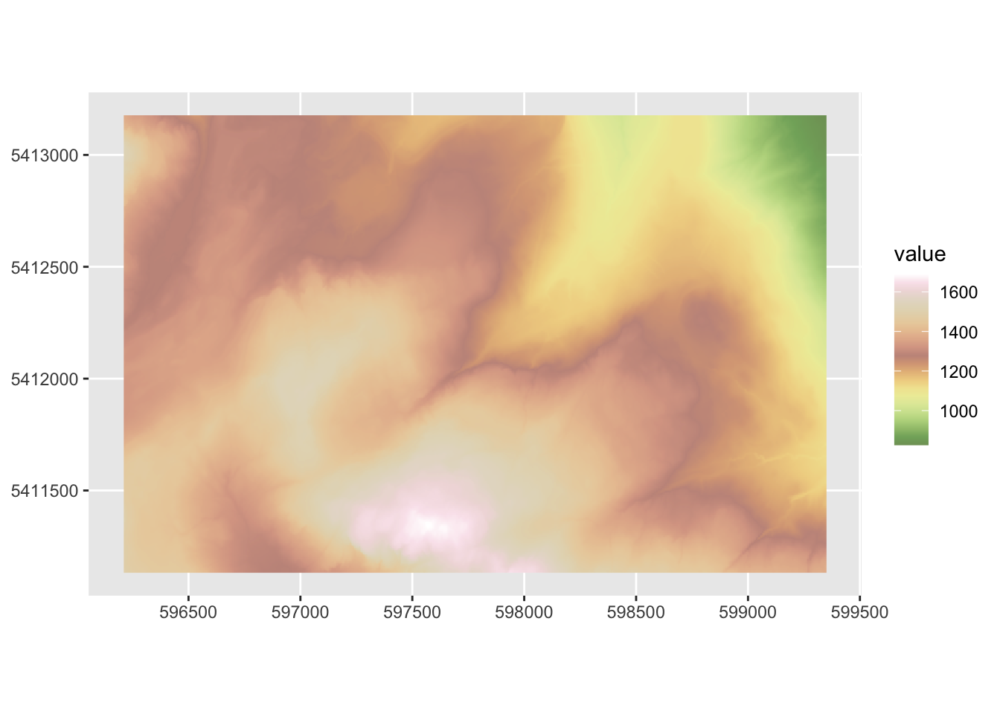
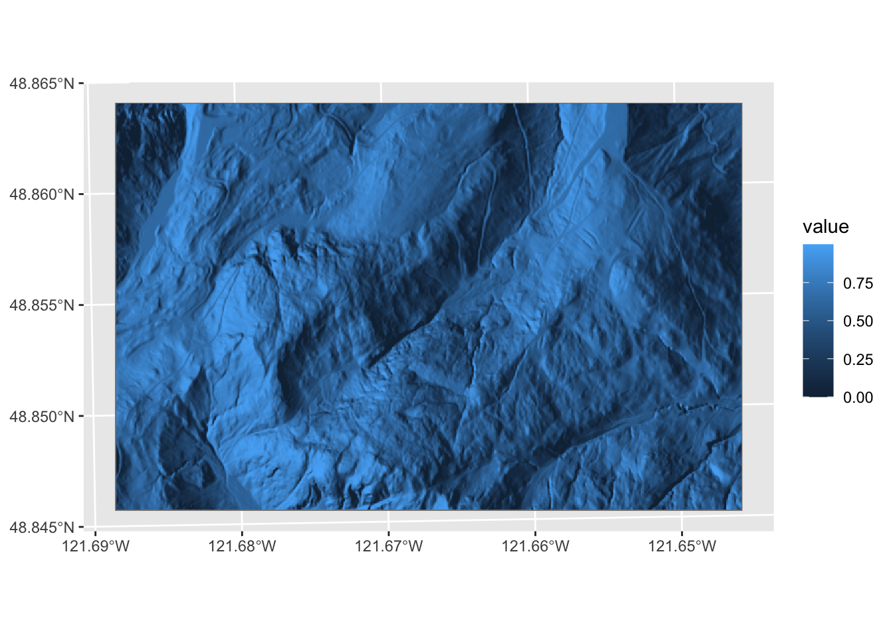
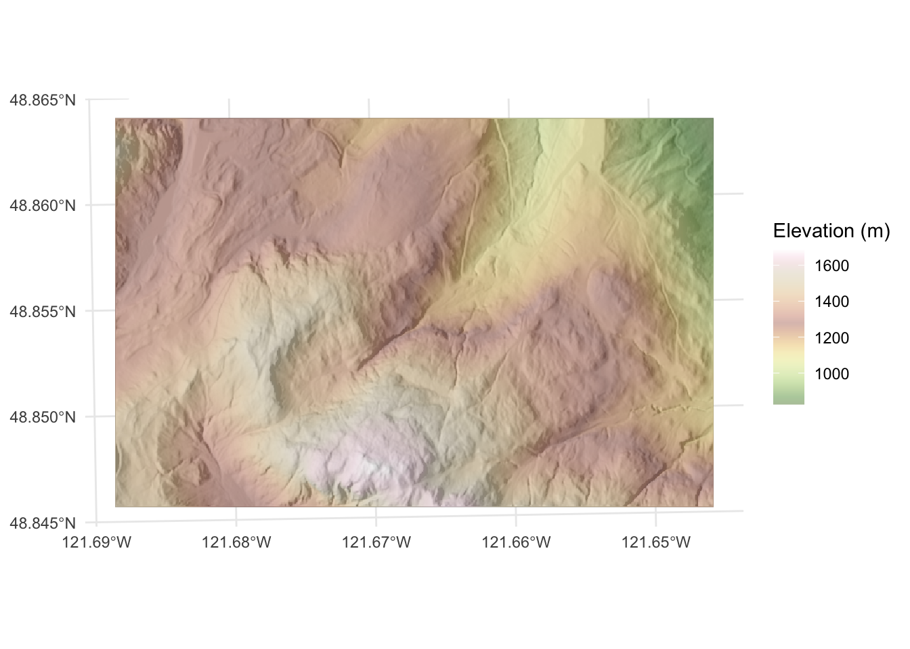
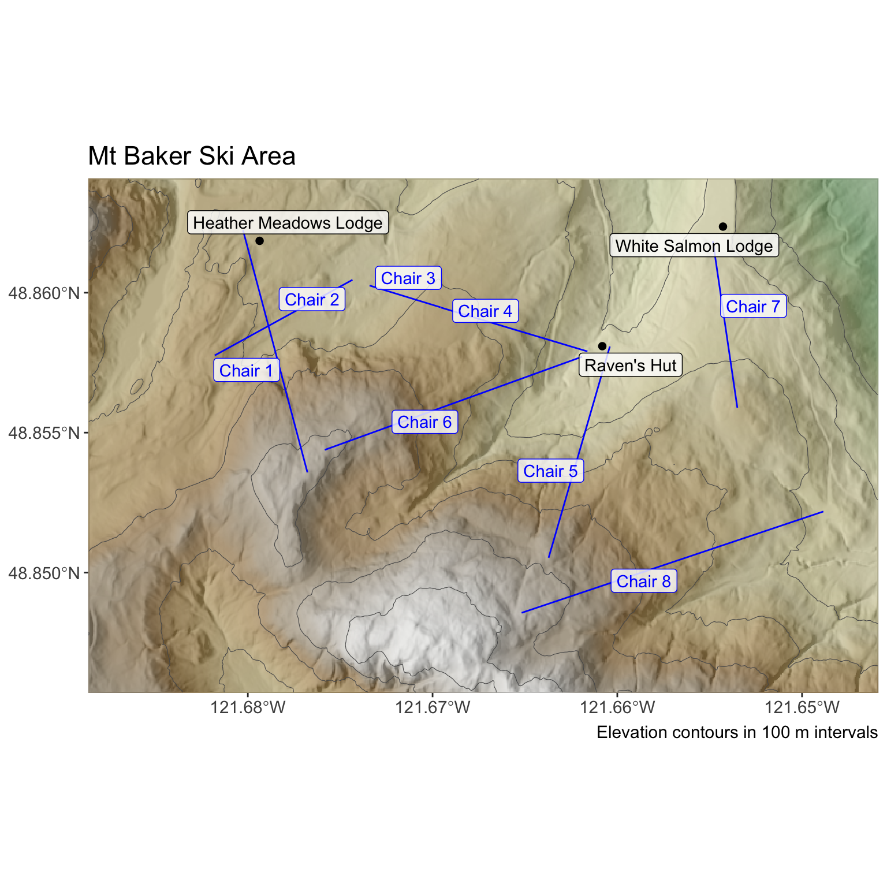

# Mt Baker Map

## Big Idea
The nuts and bolts of working with spatial data are critical to get right. Being able to use raster and vector data are going to be important as we learn spatial analytic methods.

## Packages
Install these if you need them: `sf`[@R-sf], `terra`[@R-terra], and `tidyverse`[@R-tidyverse] but if you completed the workshop from Data Carpentry they should be all good to go on your system. We'll use `tidyterra`[@R-tidyterra] and `ggnewscale`[@R-ggnewscale] as well.

But first... 

For the past couple of years there has been major upheaval underway in how projection information is getting stored and how R is working with spatial data in general (e.g., the `PROJ` projection standard is being replaced by `WKT` and the `raster` library is being superseded by `terra`. It's both complicated and extremely boring. But while the details are getting worked out, many of the different R libraries that work with the old projection scheme are throwing warnings sometimes. I'll try to anticipate that and give you workarounds if we need them. 

Ok. Let's go. 


``` r
library(terra)
```

```
## terra 1.8.93
```

``` r
library(sf)
```

```
## Linking to GEOS 3.13.0, GDAL 3.8.5, PROJ 9.5.1; sf_use_s2() is TRUE
```

``` r
library(tidyverse)
```

```
## ── Attaching core tidyverse packages ──────────────────────── tidyverse 2.0.0 ──
## ✔ dplyr     1.2.0     ✔ readr     2.2.0
## ✔ forcats   1.0.1     ✔ stringr   1.6.0
## ✔ ggplot2   4.0.2     ✔ tibble    3.3.1
## ✔ lubridate 1.9.5     ✔ tidyr     1.3.2
## ✔ purrr     1.2.1
```

```
## ── Conflicts ────────────────────────────────────────── tidyverse_conflicts() ──
## ✖ tidyr::extract() masks terra::extract()
## ✖ dplyr::filter()  masks stats::filter()
## ✖ dplyr::lag()     masks stats::lag()
## ℹ Use the conflicted package (<http://conflicted.r-lib.org/>) to force all conflicts to become errors
```

``` r
library(ggnewscale)
library(tidyterra)
```

```
## 
## Attaching package: 'tidyterra'
## 
## The following object is masked from 'package:stats':
## 
##     filter
```

## Prepratory Work
Before continuing you should have completed [this Introduction to Geospatial Concepts](https://datacarpentry.org/organization-geospatial/) from the good folks at Data Carpentry as well as [Introduction to Geospatial Raster and Vector Data with R](https://datacarpentry.org/r-raster-vector-geospatial/). 

The people in this class have tremendously varying levels of experience working with spatial data. Some are GIS pros (literally) and conversant with different data types and spatial schemas. Others are spatial novices. Finishing both of these will help establish a common baseline of knowledge.

## Introduction
Because some of you are GIS experts and some of you have only done a tiny bit of GIS, we a tough dynamic in class. This is because a lot of working with spatial data is in the mechanics of displaying and handling data from different sources as well as the whole idea of projecting data from a roundish planet onto a plane. We will focus as much as we can on the big picture of how spatial patterns let us make inference about environmental processes. But we need to be able to do some basic GIS work in R. This assignment builds on what you've done in the Data Carpentry workshops and has you make a map using data you haven't seen before.

I've been working on a cool spatial analysis project up at the Mt Baker ski hill. I won't go into it now, but it is a project to improve geolocation for skiers and riders using very inexpensive RFID equipment. We will look at some of those data later in class but let's start with just making a map of some of the features at the ski hill. Many of you are familiar with the area from recreating. 

## The Data

First we have a digital elevation model (DEM) of the area near the ski hill. I'll read this in here using `raster` from the `terra` library. Note that these data are projected in UTM (EPSG:32610) so the units are in meters. The DEM has five meter resolution.


``` r
mtbDEM <- rast("data/mtbDEM.tif")
mtbDEM
```

```
## class       : SpatRaster 
## size        : 409, 628, 1  (nrow, ncol, nlyr)
## resolution  : 5, 5  (x, y)
## extent      : 596210.7, 599350.7, 5411132, 5413177  (xmin, xmax, ymin, ymax)
## coord. ref. : WGS 84 / UTM zone 10N (EPSG:32610) 
## source      : mtbDEM.tif 
## name        :      elev 
## min value   :  826.4308 
## max value   : 1689.3694
```

``` r
# and a quick plot
mtbDEM_df <- as.data.frame(mtbDEM, xy = TRUE)
ggplot() + 
  geom_raster(data = mtbDEM_df , mapping = aes(x = x, y = y,
                                               fill = elev)) + 
  scale_fill_gradientn(colours = terrain.colors(100)) +
  labs(x="Easting (m)", y = "Northing (m)") +
  coord_equal()
```



This is very similar to the way that the carpentries workshop approached mapping where you take the raster layer from `rast` and then turn it into a `data.frame` for plotting. And that works fine. I've using the `tidyterra` library which has a `ggplot` geometry for the `SpatRaster` class. That seems easier to me. So here is a simpler approach using `geom_spatraster`. Oh, and `tidyterra` has some very cool color schemes. Look at `?hypso.colors`.


``` r
ggplot() +
  geom_spatraster(data = mtbDEM) +
  scale_fill_hypso_c(palette = "usgs-gswa2")
```



Note that unlike `geom_raster()`, `geom_spatraster()` uses the projection information and shows us the plot using latitude and longitude. That can mess us up if we aren't careful because the projection for `mtbDEM` is un UTM. If we wanted to we can plot in the original projection with `coord_sf()`.


``` r
ggplot() +
  geom_spatraster(data = mtbDEM) +
  scale_fill_hypso_c(palette = "usgs-gswa2") +
  coord_sf(datum = 32610)
```



Next, I made a hillshade layer from the elevation model.This is a common way to get a 3D representation of a surface that basically shines a light onto a surface at a specified angle and elevation to create shading the image. We need make a slope raster and an aspect raster in order to be able to calculate hillshade.


``` r
mtbSlope <- terrain(mtbDEM, "slope", unit="radians")
mtbAspect <- terrain(mtbDEM, "aspect", unit="radians")
mtbHillshade <- shade(mtbSlope, mtbAspect, angle = 40, direction = 270)
mtbHillshade[mtbHillshade < 0] <- 0
names(mtbHillshade) <- "value" # these are unitless
mtbHillshade
```

```
## class       : SpatRaster 
## size        : 409, 628, 1  (nrow, ncol, nlyr)
## resolution  : 5, 5  (x, y)
## extent      : 596210.7, 599350.7, 5411132, 5413177  (xmin, xmax, ymin, ymax)
## coord. ref. : WGS 84 / UTM zone 10N (EPSG:32610) 
## source(s)   : memory
## varname     : mtbDEM 
## name        :    value 
## min value   : 0.000000 
## max value   : 0.999856
```

``` r
# and a quick plot
ggplot() +
  geom_spatraster(data = mtbHillshade)
```



You can combine these with and show both rasters using transparency. 


``` r
p1 <- ggplot() +
  geom_spatraster(data = mtbHillshade) +
  scale_fill_gradientn(colors = gray.colors(100,
                                            start = 0.1,
                                            end = 0.9), guide = "none") +
  new_scale_fill() +
  geom_spatraster(data = mtbDEM) +
  scale_fill_hypso_c(name = "Elevation (m)", 
                     palette = "usgs-gswa2",alpha = 0.6) +
  theme_minimal()
p1
```



Walk through the code and note how I added the hillshade in grey first and then added the elevation layer afterwards with a transparency. I used `new_scale_fill` from the `ggnewscale` library to allow for more than one scale for the fill aesthetic.  Refer back to the last module for mapping hillshades for a different approach. 

Next, we have a shapefile of line data showing where the chairlifts are. I'll read that in using `st_read()` from the `sf` library. These data are also projected in UTM.


``` r
chairs <- st_read("data/mtbChairLines.shp")
```

```
## Reading layer `mtbChairLines' from data source 
##   `/Users/andybunn/Documents/teaching/current/ESCI505/spatialNotes/data/mtbChairLines.shp' 
##   using driver `ESRI Shapefile'
## Simple feature collection with 8 features and 1 field
## Geometry type: LINESTRING
## Dimension:     XY
## Bounding box:  xmin: 596713.7 ymin: 5411451 xmax: 599131.5 ymax: 5412970
## Projected CRS: UTM_Zone_10_Northern_Hemisphere
```

``` r
p1 + geom_sf(data=chairs)
```


And finally, here is the location of the three lodges stored in a simple csv file.The coordinates are in UTM as above.


``` r
buildings <- read.csv("data/mtbLodges.csv")
buildings
```

```
##          X       Y                    id
## 1 598732.6 5412985    White Salmon Lodge
## 2 596891.9 5412928 Heather Meadows Lodge
## 3 598253.1 5412510           Raven's Hut
```

Note that I've given you three different kinds of spatial data. As geospatially-explicit raster in an external file (a GeoTif), a shapefile (shp) of lines, and a text file of points. The first two are already projected. The last is not (but the units are at least the same).

## A Map
Here is a map of the area I made with `ggplot` using the objects `mtbDEM`, `chairs`, and `buildings`. I'll be the first to tell you that I'm no cartographer and this is not an excellent map but it is adequate. In most cases, I show you exactly what I'm doing with all the R code by setting `echo=TRUE` in all my chunks. For this map, I hid the code I used because I want you to make your own as I explain below in the "Your Work" section. 





## Your work
Make a pretty map of the Mt Baker ski hill area using the data above. You can color outside the lines (e.g., pull in imagery from Google Earth or use other ancillary data) if you like. There are few limits to what you can do but you need to use all three data sets in one map. The idea here is to make sure you can handle raster data and two types of vector data (points and lines) simultaneously.

Turn in a knitted R Markdown document in HTML that has a map and explain what you did. Make sure all your code is clean, your variables named well, your explanations clear. Show all the code.

Finally, there is a lot to do in this class. As such, I'm not going to ask you to do a bunch of fancy cartography. In general I want you to focus on the spatial analysis and not fall into time sinks of map making. But I'm not against you making cool maps! Feel free to experiment with cartography. The Lovelace chapter [Making maps with R](https://geocompr.robinlovelace.net/adv-map.html) is a great resource for `tmap` etc.
