# Deterministic Interpolation: Inverse Distance Weighting


## Reading
Start with Hijmans's [Interpolation](https://rspatial.org/analysis/4-interpolation.html#). The examples using inverse weights to interpolate the California precipitation data are excellent. We will finish Ch 8 in Bivand (2008) next module so you can tackle that as time and motivation allow.

Bivand R (2008) Interpolation and Geostatistics. In: Applied Spatial Data Analysis with R. Use R!. Springer, New York, NY.

## Big Idea
We often want to estimate phenomena at locations where we do not have measurements. Geostatistics is the field that we use to make (hopefully) accurate and reliable models of spatial data. We will use these models for prediction. We can use both deterministic and probabilistic models and this module will focus on deterministic methods.

## Packages
The `gstat`[@R-gstat] package is your friend. And I'm going to plot in `ggplot` via `tidyverse`[@R-tidyverse] with `sf`[@R-sf], `terra`[@R-terra] and `tidyterra`[@R-tidyterra]. 


``` r
library(tidyverse)
library(sf)
library(gstat)
library(terra)
library(tidyterra)
```


## Geostats
The term "geostatistics" is big and vague and like the term "statistics" covers both descriptive and inferential approaches. The, somewhat tautological, difference is the prefix "geo." In geostatistics we use the spatial structure in the data to aid our understanding -- whether that is descriptive and inferential. The key is that we use space.

So far in class, we've been mostly describing spatial patterns and sometimes using those patterns to make inference about processes. But we haven't done much predicting. That's where we are going to focus now. For instance, as most of you have experienced for yourselves, collecting data is expensive and time consuming. Often we collect samples of something and hope to make larger inferences about some phenomenon based on a sample (e.g., [we use the sample mean to infer the population mean](https://www.khanacademy.org/math/statistics-probability/sampling-distributions-library/sample-means/v/statistics-sample-vs-population-mean)). In geostatistics, we analyze and often predict some variable associated with spatial phenomena. Because we know how to measure spatial structure (e.g., autocorrelation) we can use that information on pattern to better understand some process. And practically, if we have  samples at known locations we can use geostatistical techniques to produce predictions and related measures of uncertainty of the predictions for unsampled locations.

## Theory
We are going to tackle the broader theory and application of geostatistics (which did indeed develop from the desire to get more gold out of the ground in South Africa) but we are going to start with a conceptual application that predates geostatistics as a discipline. We have already introduced the idea of inverse distance weights (IDW) with our matrix $W$ from the Moran's I calculation where $w_{ij}=d_{ij}^{-1}$.

Using distance as a predictor implements the so-called first law of the geography "Everything is related to everything else, but near things are more related than distant things." IDW uses this assumption to predict a variable at unmeasured locations by using nearby measurements. The closer the measured values are to the prediction location, the more influence (weight) they have. With IDW, influence diminishes as a function of distance.

We are now going to use IDW as a way to get an estimate of a variable ($\hat{Z}$) at a spatial location $s_0$ using a weighted spatial average:

$$\hat{Z}(s_0)=\frac{\sum_{i=1}^n w(s_i)Z(s_i)}{\sum_{i=1}^n w(s_i)}$$

where $w$ is the weights of $n$ measurements at $i$ locations ($s$). The weight is calculated as a function of inverse distance:
$$ w(s_i) = ||s_i - s_0||^{-p} $$

where $|| \cdot ||$ indicates Euclidean distance and $p$ is a weighting power (often defaulting to two). The inverse power determines the influence that nearby points have ($w$ closer to one) as compared to points farther away ($w$ closer to zero) in the weighted average.

Let's visualize the function where weight ($w$) equals the inverse of distance ($d$): $w=d^{-1}$ as such:

``` r
foo <- data.frame(d = 1:100, w = (1:100)^-1)
foo %>% ggplot(mapping = aes(x=d,y=w)) + geom_line() +
  labs(x="Distance",y="Weight")
```

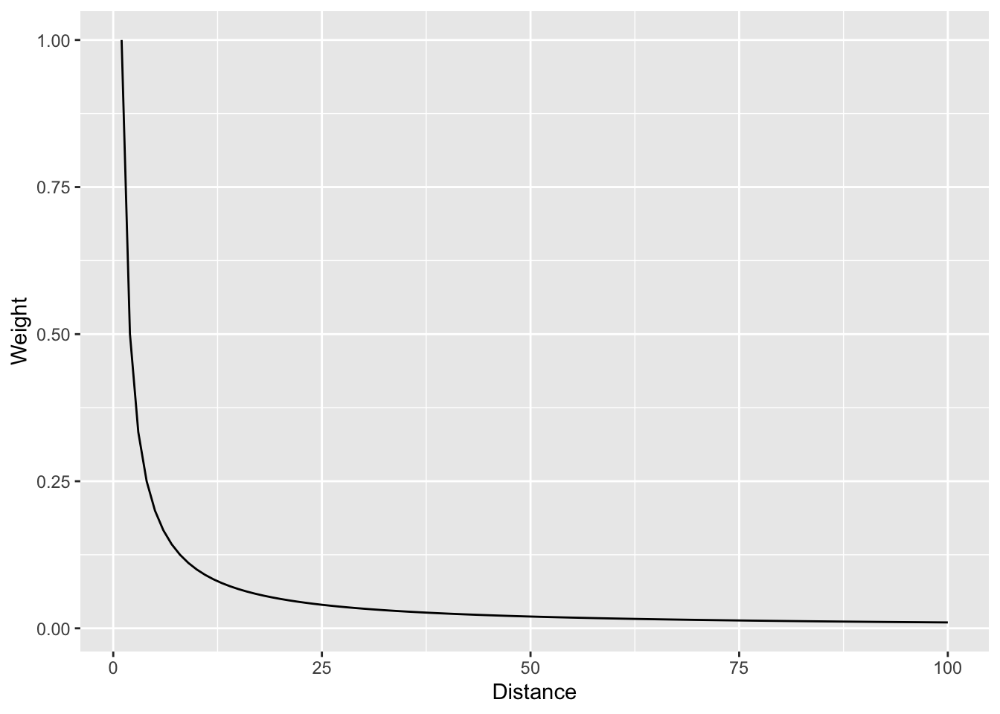

And with a log scale to see more clearly.


``` r
foo %>% ggplot(mapping = aes(x=d,y=w)) + geom_line() +
  labs(x="Distance",y="Weight") +
  scale_y_log10()
```

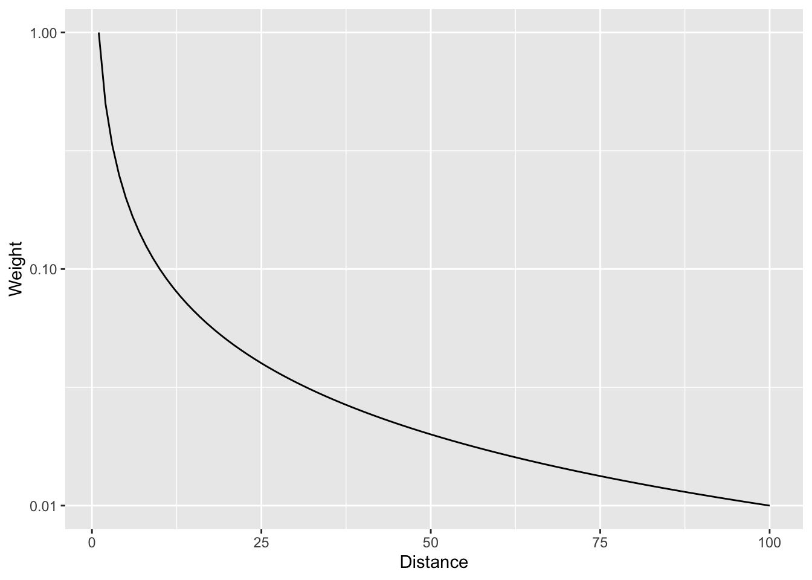

In that case we are using the straight inverse distance as $w=d^{-1}$ or $w=d^{-p}$ where $p=1$. But what if that curve is too steep? Or not steep enough? We can choose a value of $p$. E.g., the function can be $w=d^{-2}$ if we set $p=2$. Let's look at a range of $p$ values.

``` r
foo <- rbind(data.frame(d = 1:100, w = (1:100)^0, p = "0"),
             data.frame(d = 1:100, w = (1:100)^-0.5, p = "0.5"),
             data.frame(d = 1:100, w = (1:100)^-1, p = "1"),
             data.frame(d = 1:100, w = (1:100)^-1.5, p = "1.5"),
             data.frame(d = 1:100, w = (1:100)^-2, p = "2"),
             data.frame(d = 1:100, w = (1:100)^-2.5, p = "2.5"))
foo %>% ggplot(mapping = aes(x=d,y=w,color=p)) + geom_line() +
  labs(x="Distance",y="Weight")
```

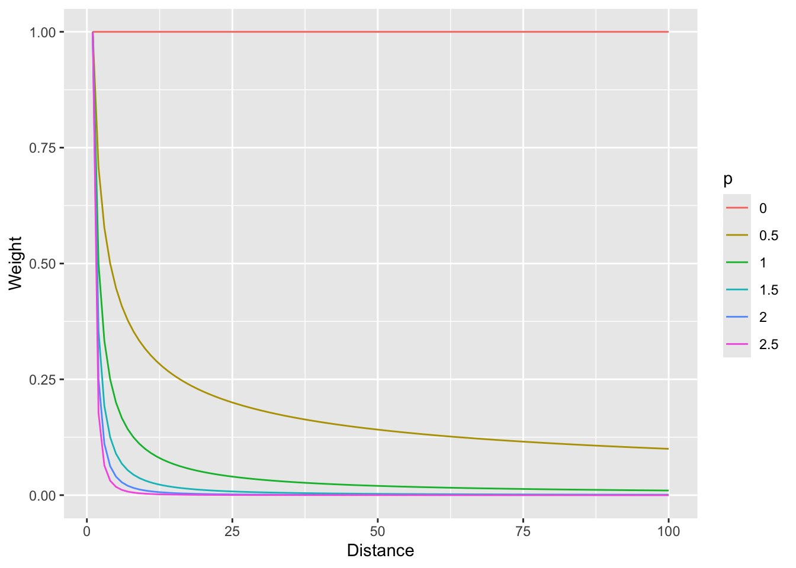

And with a log scale to see more clearly (if you can think in logs -- it takes me awhile to wrap my head around it, but then I'm glad I did).


``` r
foo %>% ggplot(mapping = aes(x=d,y=w,color=p)) + geom_line() +
  labs(x="Distance",y="Weight") +
  scale_y_log10()
```

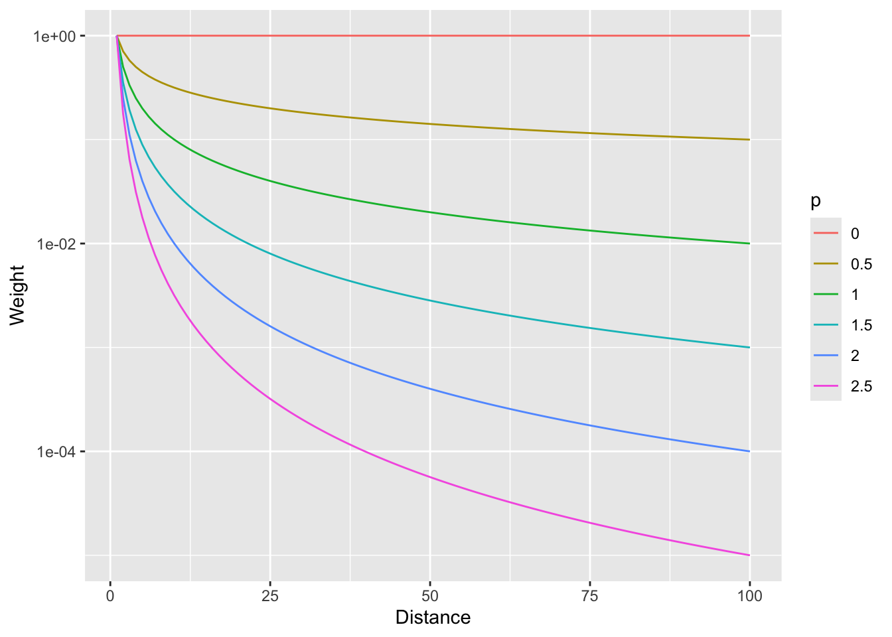

So, $p=0$ would weight all distances equally and as $p$ increases, the weights fall off quickly with distance.

## Toy example
### Data
Now that we have the information we need on the algorithm, let's do a quick and dirty example by hand to walk through some of the calculations. 

Here is a small data set of five points. We have spatial coordinates ($x$ and $y$) and some measured variable ($z$).

``` r
foo <- data.frame(x = c(1,3,1,4,5),
                  y = c(5,4,3,5,1),
                  z = c(100,105,105,100,115))
foo
```

```
##   x y   z
## 1 1 5 100
## 2 3 4 105
## 3 1 3 105
## 4 4 5 100
## 5 5 1 115
```

``` r
p1 <- foo %>% ggplot() + 
  geom_point(aes(x=x,y=y,size=z)) +
  lims(x=c(0,6),y=c(0,6))
p1
```

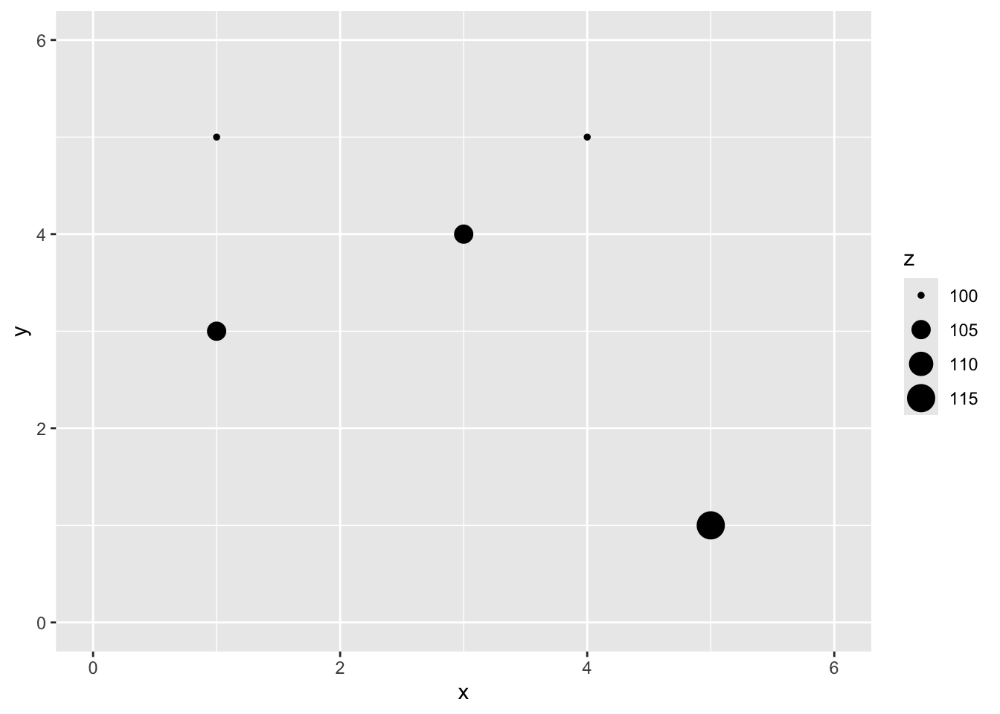

Let's imagine a point $x=2$ and $y=4$ where we don't know $z$.


``` r
p1 + geom_point(aes(x=2,y=4),color="red",size=10,shape=0) +
  geom_point(aes(x=2,y=4),color="red",size=6,shape=63)
```

```
## Warning in geom_point(aes(x = 2, y = 4), color = "red", size = 10, shape = 0): All aesthetics have length 1, but the data has 5 rows.
## ℹ Please consider using `annotate()` or provide this layer with data containing
##   a single row.
```

```
## Warning in geom_point(aes(x = 2, y = 4), color = "red", size = 6, shape = 63): All aesthetics have length 1, but the data has 5 rows.
## ℹ Please consider using `annotate()` or provide this layer with data containing
##   a single row.
```

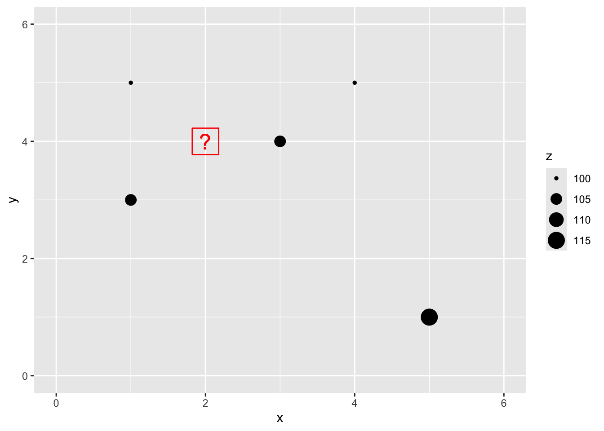

### IDW
We are now going to use IDW as a way to get an estimate of that point with a missing value of $z$. Since we are estimating it we call it $\hat{Z}$ and we know the location as $s_0$ so we call this $\hat{Z}(s_0)$. We'll follow the notation above and set the weight as a function of inverse distance with $p=2$.

The Euclidean distance to our unknown point from each of the known points is a vector: 


$$\mathbf{d_i} = \left[\begin{array}
{rr}
1 & 1.414\\
2 & 1.000\\
3 & 1.414\\
4 & 2.236\\
5 & 4.243
\end{array}\right]
$$

If we use a value of $p=2$ to get weights we have:


$$\mathbf{w(s_i)} = \left[\begin{array}
{rr}
1 & 0.500\\
2 & 1.000\\
3 & 0.500\\
4 & 0.200\\
5 & 0.056
\end{array}\right]
$$

Thus the interpolated point:


$$\hat{Z}(s_0)=\frac{0.500(100)+1.000(105)+0.500(105)+0.200(100)+0.056(115)}{0.500+1.000+0.500+0.200+0.056} = 103.7$$

``` r
# distance to missing point s0
d2s0 <- as.matrix(dist(cbind(c(foo$x,2),c(foo$y,4))))[1:5,6]
# power
p <- 2
# weights
w <- d2s0^-p
# and the estimation itself
zhat_s0 <- sum(w*foo$z)/sum(w)
zhat_s0
```

```
## [1] 103.6946
```

``` r
# add it to the plot
p1 + geom_point(aes(x=2,y=4,size=zhat_s0))
```

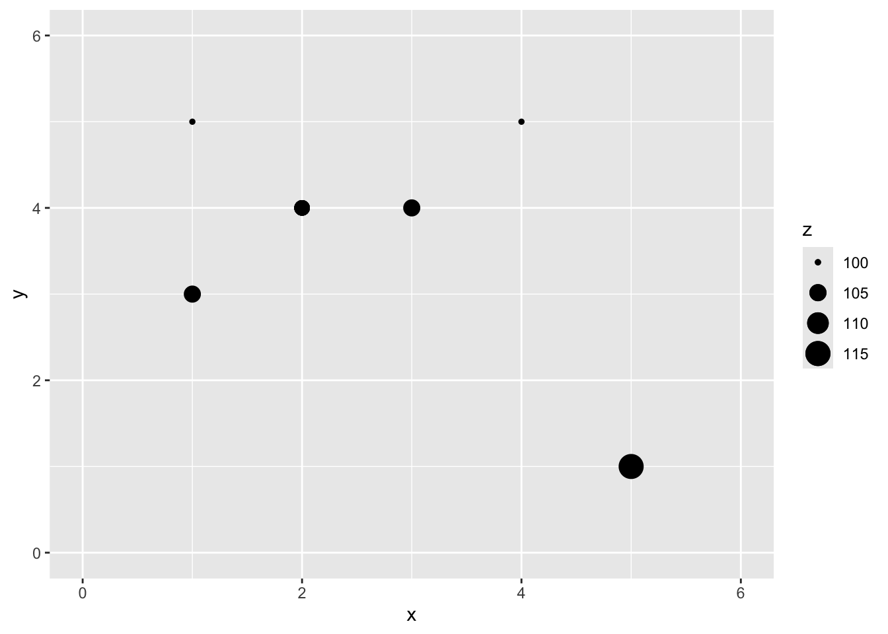

You can see how we interpolated (estimated) one point using inverse distance weighting. And you could imagine then how we'd do that for any point we could imagine.

## Application
### Data
Now that we've done a toy example, let's give this a shot with the lead data from the Meuse River. Because the lead data are pretty skewed, we will log transform it. First we'll load, then log the lead column, make it into a `sf` object and then plot.

First we will turn the `meuse` into class `sf`.


``` r
data(meuse.all)
glimpse(meuse.all)
```

```
## Rows: 164
## Columns: 17
## $ sample      <dbl> 1, 2, 3, 4, 5, 6, 7, 8, 9, 10, 11, 12, 13, 14, 15, 16, 17,…
## $ x           <dbl> 181072, 181025, 181165, 181298, 181307, 181390, 181165, 18…
## $ y           <dbl> 333611, 333558, 333537, 333484, 333330, 333260, 333370, 33…
## $ cadmium     <dbl> 11.7, 8.6, 6.5, 2.6, 2.8, 3.0, 3.2, 2.8, 2.4, 1.6, 1.4, 1.…
## $ copper      <dbl> 85, 81, 68, 81, 48, 61, 31, 29, 37, 24, 25, 25, 93, 31, 27…
## $ lead        <dbl> 299, 277, 199, 116, 117, 137, 132, 150, 133, 80, 86, 97, 2…
## $ zinc        <dbl> 1022, 1141, 640, 257, 269, 281, 346, 406, 347, 183, 189, 2…
## $ elev        <dbl> 7.909, 6.983, 7.800, 7.655, 7.480, 7.791, 8.217, 8.490, 8.…
## $ dist.m      <dbl> 50, 30, 150, 270, 380, 470, 240, 120, 240, 420, 400, 300, …
## $ om          <dbl> 13.6, 14.0, 13.0, 8.0, 8.7, 7.8, 9.2, 9.5, 10.6, 6.3, 6.4,…
## $ ffreq       <dbl> 1, 1, 1, 1, 1, 1, 1, 1, 1, 1, 1, 1, 1, 1, 1, 1, 1, 1, 1, 1…
## $ soil        <dbl> 1, 1, 1, 2, 2, 2, 2, 1, 1, 2, 2, 1, 1, 1, 1, 1, 1, 1, 1, 1…
## $ lime        <dbl> 1, 1, 1, 0, 0, 0, 0, 0, 0, 0, 0, 0, 1, 0, 0, 1, 1, 1, 1, 1…
## $ landuse     <fct> Ah, Ah, Ah, Ga, Ah, Ga, Ah, Ab, Ab, W, Fh, Ag, W, Ah, Ah, …
## $ in.pit      <lgl> FALSE, FALSE, FALSE, FALSE, FALSE, FALSE, FALSE, FALSE, FA…
## $ in.meuse155 <lgl> TRUE, TRUE, TRUE, TRUE, TRUE, TRUE, TRUE, TRUE, TRUE, TRUE…
## $ in.BMcD     <lgl> FALSE, FALSE, FALSE, FALSE, FALSE, FALSE, FALSE, FALSE, FA…
```

``` r
class(meuse.all)
```

```
## [1] "data.frame"
```

``` r
meuse.all$logLead <- log(meuse.all$lead)
# or for the tidyverse fans this is the same output
meuse.all <- meuse.all %>% mutate(logLead = log(lead))
# make into sf
meuse_sf <- st_as_sf(meuse.all, coords = c("x", "y")) %>%
  st_set_crs(value = 28992)

class(meuse_sf) # note change in class from data.frame to sf and data.frame
```

```
## [1] "sf"         "data.frame"
```

``` r
p2 <- ggplot(data = meuse_sf) +
  geom_sf(aes(fill=logLead), size=4, 
          shape = 21, color="white",alpha=0.8)+
  scale_fill_continuous(type = "viridis",name="log(ppm)") + 
  labs(title="Lead concentrations")
p2
```


Let's interpolate those measurements to an empty grid that covers the whole study site. There is a handy object called `meuse.grid` that has a full grid of this area with 40-m cells stored as a `data.frame`. 


``` r
meuse.grid <- readRDS("data/meuse.grid.Rds")
head(meuse.grid)
```

```
##        x      y part.a part.b      dist soil ffreq
## 1 181180 333740      1      0 0.0000000    1     1
## 2 181140 333700      1      0 0.0000000    1     1
## 3 181180 333700      1      0 0.0122243    1     1
## 4 181220 333700      1      0 0.0434678    1     1
## 5 181100 333660      1      0 0.0000000    1     1
## 6 181140 333660      1      0 0.0122243    1     1
```

This has some of the fields (e.g., `soil`) that overlaps with `meuse`. We will use those later when we do some regression-based interpolation. Right now we just want the coordinates to predict onto which are in the first two columns. Let's make a `SpatRaster` object using `rast` form `terra`.


``` r
meuse_grid_sf <- st_as_sf(meuse.grid, 
                          coords = c("x","y"), 
                          crs = st_crs(meuse_sf))
meuse_grid_sf
```

```
## Simple feature collection with 3103 features and 5 fields
## Geometry type: POINT
## Dimension:     XY
## Bounding box:  xmin: 178460 ymin: 329620 xmax: 181540 ymax: 333740
## Projected CRS: Amersfoort / RD New
## First 10 features:
##    part.a part.b       dist soil ffreq              geometry
## 1       1      0 0.00000000    1     1 POINT (181180 333740)
## 2       1      0 0.00000000    1     1 POINT (181140 333700)
## 3       1      0 0.01222430    1     1 POINT (181180 333700)
## 4       1      0 0.04346780    1     1 POINT (181220 333700)
## 5       1      0 0.00000000    1     1 POINT (181100 333660)
## 6       1      0 0.01222430    1     1 POINT (181140 333660)
## 7       1      0 0.03733950    1     1 POINT (181180 333660)
## 8       1      0 0.05936620    1     1 POINT (181220 333660)
## 9       1      0 0.00135803    1     1 POINT (181060 333620)
## 10      1      0 0.01222430    1     1 POINT (181100 333620)
```

### IDW
So the idea here is that we will model a value for lead at each of the locations in `meuse_grid_sf`. Rather than do this by hand as we did above, we will use the very powerful `gstat` library.

We can use the coordinates in `meuse_grid_sf` as the locations to predict using IDW. We don't care about the data in `meuse_grid_sf` like soil type or distance to river. We just want the locations so we can predict lead using IDW. E.g., with a with a power of 2. To do this, we will use `gstat` function which creates an object that holds all the information necessary for prediction. Here we tell `gstat` that we want an IDW model with a weight of 2 using the `idp` parameter. The formula `logLead~1` means that we are only coordinates as predictors.


``` r
idw_p2_model <- gstat(formula=logLead~1, 
                      locations = meuse_sf,
                      set=list(idp = 2))
logLeadIDW_p2_sf <- predict(idw_p2_model,meuse_grid_sf)
```

```
## [inverse distance weighted interpolation]
```

``` r
logLeadIDW_p2_sf
```

```
## Simple feature collection with 3103 features and 2 fields
## Geometry type: POINT
## Dimension:     XY
## Bounding box:  xmin: 178460 ymin: 329620 xmax: 181540 ymax: 333740
## Projected CRS: Amersfoort / RD New
## First 10 features:
##    var1.pred var1.var              geometry
## 1   5.139711       NA POINT (181180 333740)
## 2   5.251238       NA POINT (181140 333700)
## 3   5.177608       NA POINT (181180 333700)
## 4   5.113610       NA POINT (181220 333700)
## 5   5.451866       NA POINT (181100 333660)
## 6   5.320075       NA POINT (181140 333660)
## 7   5.209441       NA POINT (181180 333660)
## 8   5.127611       NA POINT (181220 333660)
## 9   5.666344       NA POINT (181060 333620)
## 10  5.583003       NA POINT (181100 333620)
```

Now, we are going to look at the interpolated data and assess if it's a "good" interpolation in a bit. But first, let's look at the `logLeadIDW_p2_sf` object we made. This is a `sf` object returned by `predict`. The interpolated lead levels are accessed via `logLeadIDW_p2_sf$var1.pred` (we will turn a blind eye to the `logLeadIDW_p2_sf$var1.var` column of NA values for *now*). All the `gstat` functions we are going to use follow this convention so the good news is that you only have to get used to it once.

But first, the `gstat` `predict` function returned a `sf` point object. We want it to be a `SpatRaster`. You'd think there would be an elegant way to convert an evenly spaced point object into a `SpatRaster` object but there isn't at the moment so we will brute force it. This is a little irksome but whatever. I'll write a little function to do this just because we'll have to do it a few times. If you haven't done this, writing functions is a good tool to have at your disposal.


``` r
sf_2_rast <-function(sfObject,variableIndex = 1){
  # coerce sf to a data.frame
  dfObject <- data.frame(st_coordinates(sfObject),
                         z=as.data.frame(sfObject)[,variableIndex])
  # coerce data.frame to SpatRaster
  rastObject <- rast(dfObject,crs=crs(sfObject))
  
  names(rastObject) <- names(sfObject)[variableIndex]
  
  return(rastObject)
}

logLeadIDW_p2_rast <- sf_2_rast(logLeadIDW_p2_sf)
logLeadIDW_p2_rast
```

```
## class       : SpatRaster 
## size        : 104, 78, 1  (nrow, ncol, nlyr)
## resolution  : 40, 40  (x, y)
## extent      : 178440, 181560, 329600, 333760  (xmin, xmax, ymin, ymax)
## coord. ref. : Amersfoort / RD New (EPSG:28992) 
## source(s)   : memory
## name        : var1.pred 
## min value   :  3.517233 
## max value   :  6.444424
```

``` r
# and plot
ggplot() +
  geom_spatraster(data=logLeadIDW_p2_rast, mapping = aes(fill=var1.pred),alpha=0.8) +
  scale_fill_continuous(type = "viridis",name="log(ppm)",na.value = "transparent") + 
  labs(title="Lead concentrations", subtitle = "IDW with p=2") +
  theme_minimal()
```

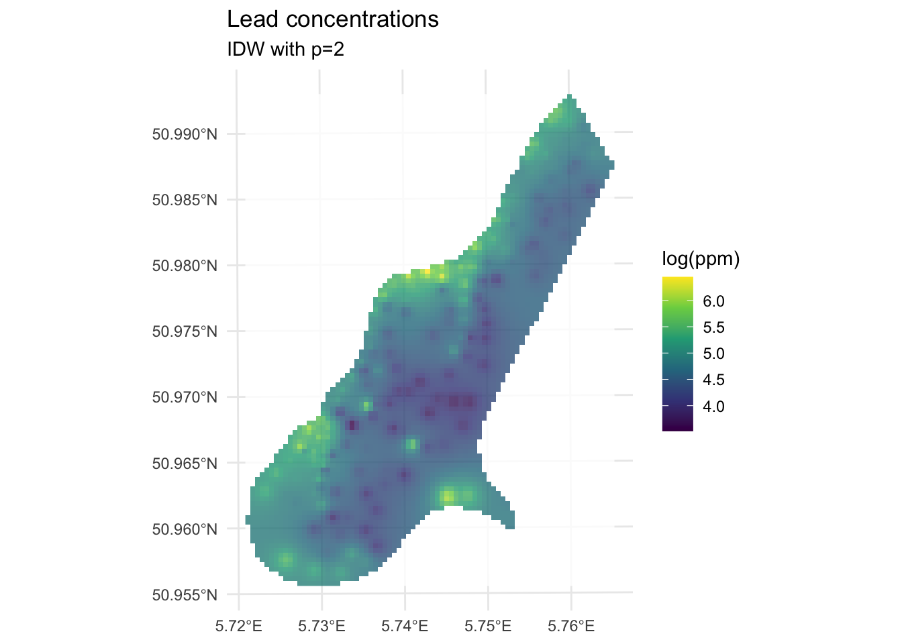

We've made a prediction. Is it any good? It kind of looks funny -- especially all those craters in the middle. Let's take another look at it with a more extreme visualization.


``` r
ggplot() +
  geom_spatraster_contour_filled(data=logLeadIDW_p2_rast,
                                 breaks = seq(from=3.5, to=6.5,by=0.25),
                                 alpha = 0.9) +
  scale_fill_discrete(name="log(ppm)",na.value = "transparent") + 
  labs(title="Lead concentrations", subtitle = "IDW with p=2") +
  theme_minimal()
```

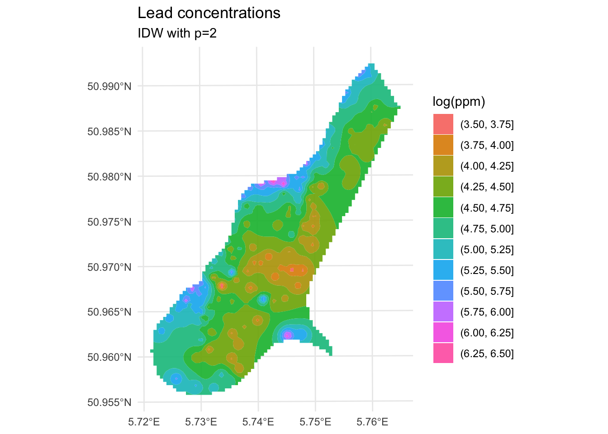

Are those bumps and craters real? Or an artifact? Would the surface be better if we changed the value of $p$? What does "better" even mean? Would we know "better" if we saw it?

## Skill
Until now in class we've mostly been describing patterns seen in samples. Now we are doing actual prediction (hence the "geostatistics" term). And with prediction comes the need to assess the skill of the predictions. Skill is a catchall term that refers to any measure of the accuracy of prediction relative to the observations. The most common ways to assess skill are to look at the R$^2$ of the observed vs predicted data as well as the root mean squared errors (RMSE). 

E.g., in the above:


``` r
obs <- meuse_sf$logLead
preds <- extract(logLeadIDW_p2_rast, meuse_sf) %>% pull(var1.pred)
rsq <- cor(obs,preds)^2
rmse <- sqrt(mean((preds - obs)^2))
rsq
```

```
## [1] 0.9936209
```

``` r
rmse
```

```
## [1] 0.07119863
```

``` r
ggplot() +
  geom_abline(slope=1,intercept = 0) +
  geom_point(aes(x=obs,y=preds)) + 
  coord_cartesian() + 
  labs(x="Observed Values",
       y="Predicted Values",
       title="Lead log(ppm)")
```

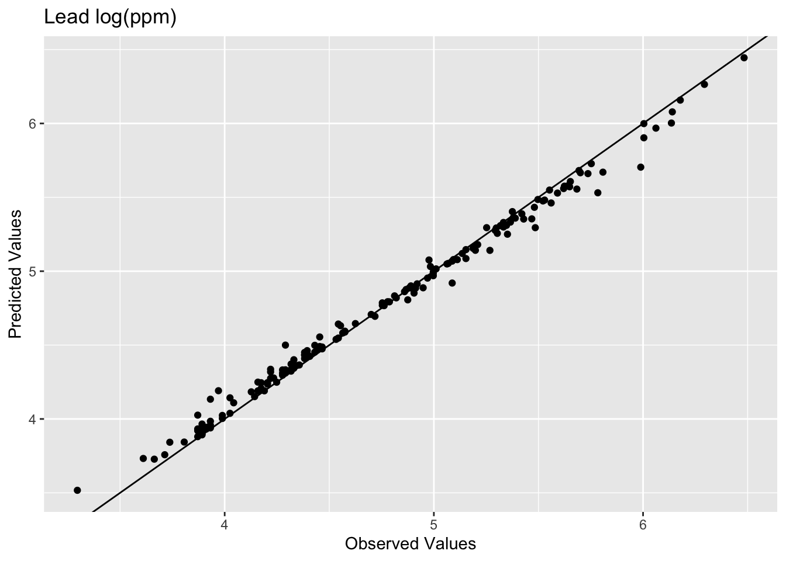

The model does an excellent job of predicting the observed values with 99% variance explained and a low RMSE. But as you are likely already aware, this is kind of a lame comparison because the IDW model knew about all those points when it made the predictions. Typically when assessing skill we withhold some portion of the data and then use that to test the model. When we test the model using the withheld data we are calculating the out-of-sample error by giving the model a chance to predict some data is hasn't seen before. E.g., let's withhold 25% of the data (38 points), do the interpolation, and then look at how well the model predicted the withheld points.


``` r
n <- nrow(meuse_sf)
rows4test <- sample(x = 1:n,size = n*0.25)
meuseTest <- meuse_sf[rows4test,]
meuseTrain <- meuse_sf[-rows4test,]

# note that we build the model with meuseTrain
idw_p2_model <- gstat(formula=logLead~1, 
                      locations = meuseTrain,
                      set=list(idp = 2))
logLeadIDW_p2_sf <- predict(idw_p2_model,meuse_grid_sf)
```

```
## [inverse distance weighted interpolation]
```

``` r
logLeadIDW_p2_rast <- sf_2_rast(logLeadIDW_p2_sf)

# and plot
ggplot() +
  geom_spatraster(data=logLeadIDW_p2_rast, mapping = aes(fill=var1.pred),alpha=0.8) +
  scale_fill_continuous(type = "viridis",name="log(ppm)",na.value = "transparent") + 
  labs(title="Lead concentrations", subtitle = "IDW with p=2") +
  theme_minimal()
```


We built the model with the training data `meuseTrain` which had 75% of the original data. We kept 25% of the data hidden from the model in `meuseTest`. By comparing the predictions from the training data to the withheld values from the testing data we can assess the out-of-sample skill. 


``` r
# note use of meuseTest here
obs <- meuseTest$logLead
preds <- extract(logLeadIDW_p2_rast, meuseTest) %>% pull(var1.pred)
rsq <- cor(obs,preds)^2
rmse <- sqrt(mean((preds - obs)^2))
rsq
```

```
## [1] 0.4448072
```

``` r
rmse
```

```
## [1] 0.5127379
```

``` r
ggplot() +
  geom_abline(slope=1,intercept = 0) +
  geom_point(aes(x=obs,y=preds)) + 
  coord_fixed(ratio=1, xlim = range(preds,obs),ylim = range(preds,obs)) +
  labs(x="Observed Values",
       y="Predicted Values",
       title="Lead log(ppm)")
```

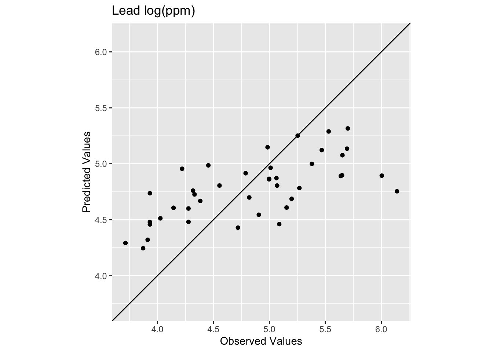

Oooof. Looking at that plot and the code we see now that the skill of the model is greatly decreased with R$^2$ = 0.4448072 and RMSE = 0.5127379. We can also see that the predicted values are less than the observed values for these points.

What we just did above is bear minimum that you need to do with any kind of statistical prediction. How well the model fits the observed data is not nearly as informative as how well it fits withheld data. Note that there is nothing special about 25% for withheld data! It's an example I'm using here but most of you will be hip to the idea that have much cleverer schemes for looking at out-of-sample error like cross validation.

### Aside: RMSE NULL Model
When using RMSE it's good to know if you are doing better than a random expectation. We can establish a very simple NULL model for RMSE by using the mean value of lead as the NULL predictions.

Here is the RMSE of the NULL case where everything is predicted as the mean:


``` r
obs <- meuse_sf$logLead
preds <- mean(meuse_sf$logLead)

rmseNULL <- sqrt(mean((preds - obs)^2))
rmseNULL
```

```
## [1] 0.6703433
```

Our `rmse` is quite a bit better than the `rmseNULL`. Which is good! We can hopefully do better than the mean as a predicted surface. One way that people use RMSE is to calculate a relative performance as:


``` r
1 - (rmse / rmseNULL)
```

```
## [1] 0.2351115
```

This is conceptually similar to using R$^2$. There is a thread about this [here](https://stats.stackexchange.com/questions/218418/comparing-rmse-to-model) for the curious. And more in the reading. To make that relative performance into a test you'd need to set it in a permutation framework. That is probably overkill here but something to be aware of.

## How can we improve this model?
Improving a model's skill (without overfitting it) is an art. In this case, IDW is a pretty blunt tool. In fact it is completely **deterministic**. I.e., there is no probability theory underlying the method. We will get into probabilistic interpolation with a technique called kriging in the next module.

What can we do right now? We could start trying to "tune" the model using parameters we can adjust. The power function is the easiest to mess with but we could also specify a minimum or maximum number of points used for the interpolation (arguments `nmax` and `nmin`) or a maximum distance that can influence the interpolation (`maxdist`).

For example, here is the same data as above with $p=2.5$ instead of $p=2$.


``` r
idw_p2.5_model <- gstat(formula=logLead~1, 
                        locations = meuseTrain,
                        set=list(idp = 2.5))

logLeadIDW_p2.5_sf <- predict(idw_p2.5_model,meuse_grid_sf)
```

```
## [inverse distance weighted interpolation]
```

``` r
logLeadIDW_p2.5_rast <- sf_2_rast(logLeadIDW_p2.5_sf)

# and plot
ggplot() +
  geom_spatraster(data=logLeadIDW_p2.5_rast, mapping = aes(fill=var1.pred),alpha=0.8) +
  scale_fill_continuous(type = "viridis",name="log(ppm)",na.value = "transparent") + 
  labs(title="Lead concentrations") +
  theme_minimal()
```

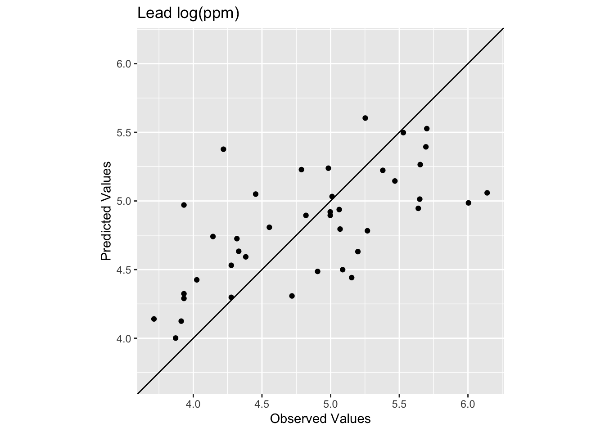

How does this surface differ? Here is the skill on the withheld data:


``` r
# note use of meuseTest here
obs <- meuseTest$logLead
preds <- extract(logLeadIDW_p2.5_rast, meuseTest) %>% pull(var1.pred)
rsq <- cor(obs,preds)^2
rmse <- sqrt(mean((preds - obs)^2))
rsq
```

```
## [1] 0.4386529
```

``` r
rmse
```

```
## [1] 0.4940241
```

``` r
ggplot() +
  geom_abline(slope=1,intercept = 0) +
  geom_point(aes(x=obs,y=preds)) + 
  coord_fixed(ratio=1, xlim = range(preds,obs),ylim = range(preds,obs)) +
  labs(x="Observed Values",
       y="Predicted Values",
       title="Lead log(ppm)")
```

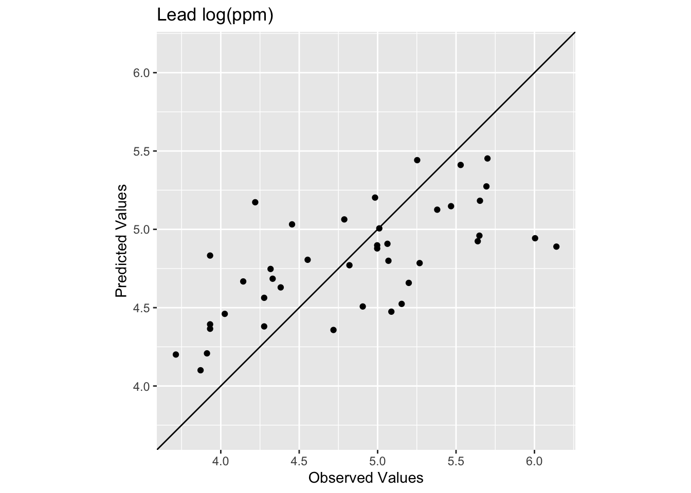

The R$^2$ is higher and the RMSE is lower. It's a better fit but not much better. And the interpolated surface still looks funny. 

Ultimately there isn't a lot we can do to improve the fits in the middle of this particular study site using IDW. The data in that area are very sparse and thus form the craters that we see. No method does a great job with sparse data as compared to thick data but IDW is is especially susceptible to errors associated with widely spaced points. And because it is a deterministic method we don't get an error estimate associated with any particular prediction like we will when we turn to kriging in the next module.


## Your Work
Let's turn to the California precipitation data that Hijmans uses for the nearest neighbor interpolation but we will do something cooler. We will make a continuous 10x10km surface of precipitation from the 432 locations of long-term precipitation records.

There are two files:

1. `prcpCA.rds` is a data frame with 432 points containing precipitation information. The columns `X` and `Y` give the coordinates of the station projected in California Albers [EPSG:3310](https://epsg.io/3310) with units in meters. We want to use the `ANNUAL` column which is total annual precipitation at that point in mm.

2. `gridCA.rds` is data frame with two columns `X` and `Y` that represent an empty grid of cells that we will interpolate the precip values into like we did with `meuse.grid` above. The spacing is 10x10 km for each point.


``` r
# precip point data
prcpCA <- readRDS("data/prcpCA.rds")
# empty grid to interpolate into
gridCA <- readRDS("data/gridCA.rds")

# make as sf
prcpCA <- prcpCA %>% st_as_sf(coords = c("X", "Y")) %>%
  st_set_crs(value = 3310)

# simple map -- see postscript below for a fancy map
prcpCA %>% ggplot() + 
  geom_sf(aes(fill=ANNUAL,size=ANNUAL),color="white",
          shape=21,alpha=0.8) + 
  scale_fill_continuous(type = "viridis",name="mm") + 
  labs(title="Total Annual Precipitation") +
  scale_size(guide="none")
```

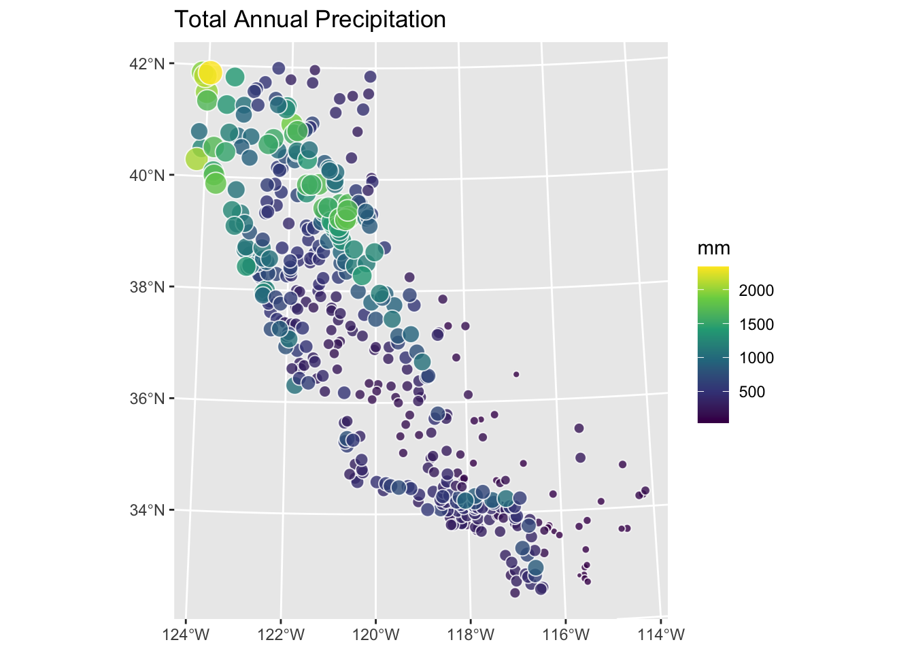

Use IDW to create a surface of total annual precipitation in California. Tune and assess skill as you see fit. Interpret and explain your surface and anything you notice in particular about it. 

One warning. There are a few stations on the coast that are classified as `NA` in the gridded surface you'll make. This is because the gridded surface is 10x10 km and that coarse resolution means some of the edge cases (stations very close to the coast) get turned into "ocean" instead of "land". This is a really common issue when moving from point to raster data. It won't affect what you do until you try to assess skill. Then you'll find that some (eight, I think) of the stations will show up as `NA` when you use `extract`. This will cause your `rsq` and `rmse` calculations to return `NA`. You can overcome this in a variety of ways (e.g., `cor(obs,preds,use="complete.obs")^2` and `sqrt(mean((preds - obs)^2,na.rm=TRUE))` or with a mask etc.). You'd have figured that out on your own I bet, but I'm just giving you a heads up.


