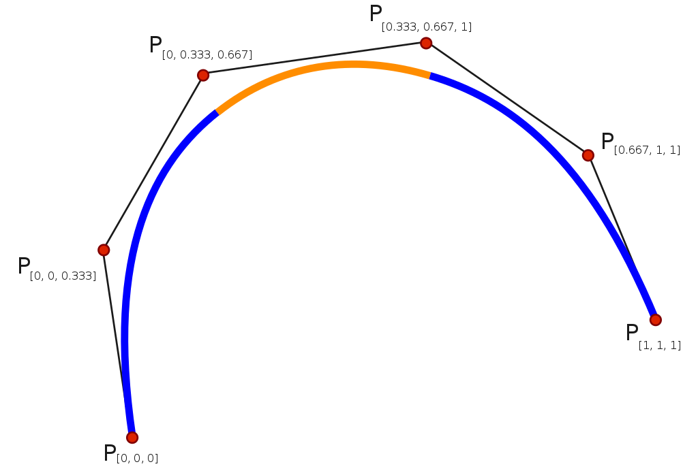
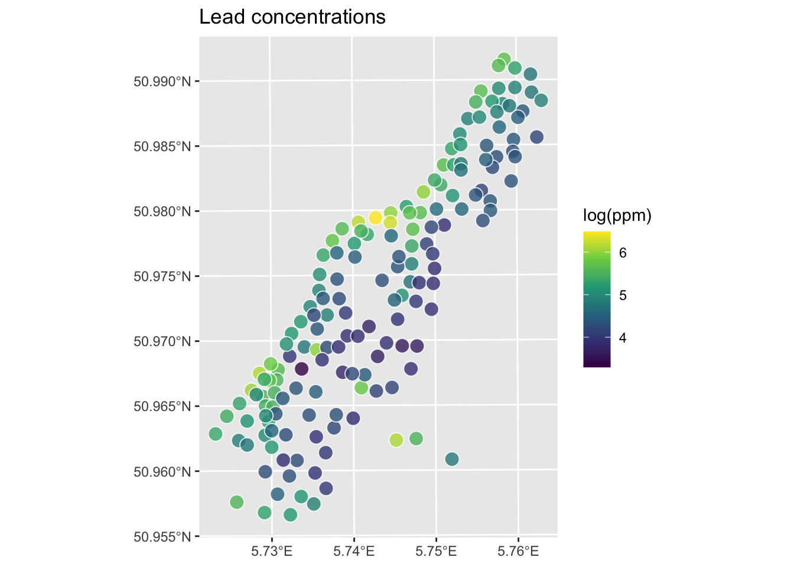
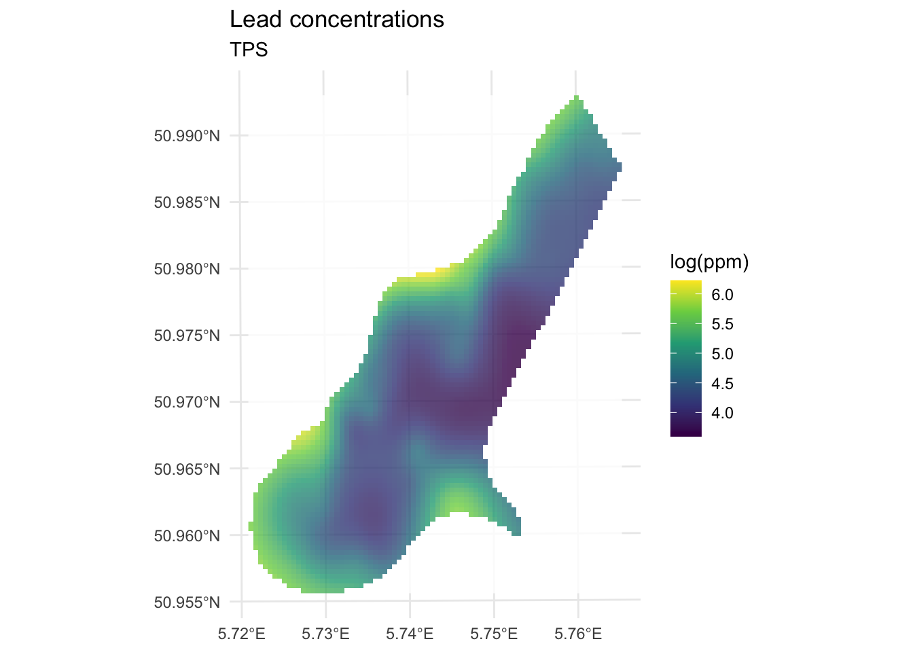
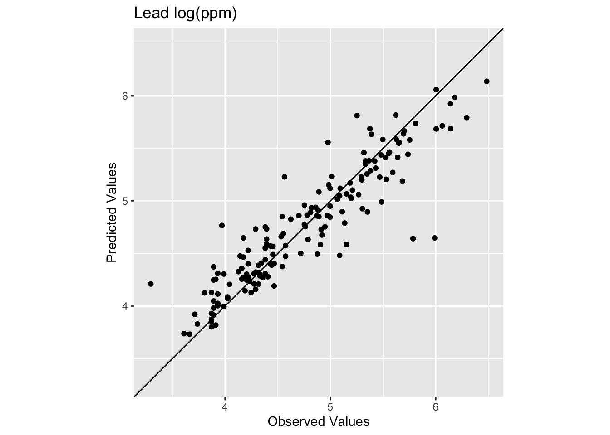
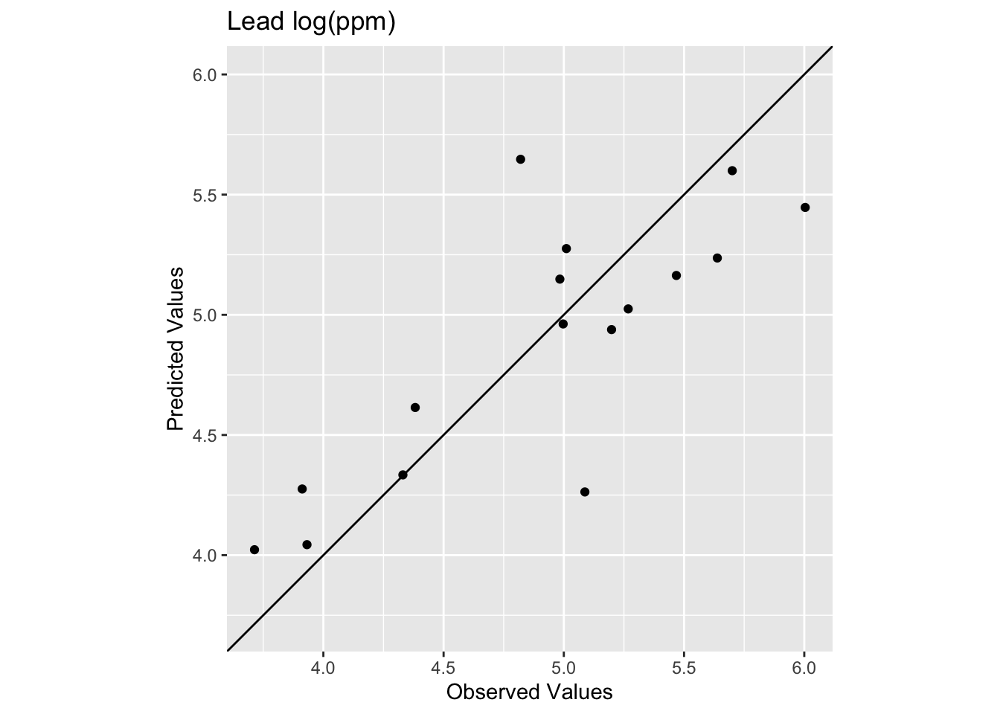

# Deterministic Interpolation: Thin-Plate Splines


## Reading
In the Hijmans's [Interpolation](https://rspatial.org/analysis/4-interpolation.html#) section he covers thin-plate splines using an example but doesn't discuss the theory at all. Bivand also waves at it in Ch 8. However, ESRI has a descent reading on [radial basis functions](https://pro.arcgis.com/en/pro-app/help/analysis/geostatistical-analyst/how-radial-basis-functions-work.htm) that is worth checking out. 

## Packages
The `fields` package is your friend. 


``` r
library(fields)
library(tidyverse)
library(gstat)
library(sf)
library(terra)
library(tidyterra)
```

## Radial Bias Functions and TPS
This is a quick and dirty introduction to thin-plate splines (TPS). TPS is a second deterministic method for interpolation. This isn't a method I've worked with much but it is an increasingly common interpolation method I've seen used in the wild. I thought a short intro would be appropriate even if we don't cover this in the same depth that we did for IDW and that we will for kriging.

A [spline](https://en.wikipedia.org/wiki/Flat_spline) is tool (historically bendy strips of wood or metal or rubber) used to draw curves. You might use them if you are into drawing, drafting, or woodworking. In computing and math they are functions of piece-wise polynomial curves that can fit complex functions. E.g., cubic smoothing splines.

  

There are many different algorithms and theoretical underpinnings for splines and we don't even have to come close to explaining those. Splines are used commonly in time-series analysis for smoothing data and can also be used for spatial analysis and even in higher dimension applications.

One way to think about how we can use splines for spatial interpolation is draping a sheet over a surface. So imagine an elevation model, say the one we used at Mt Baker. If you threw a giant sheet over that you'd have a thin surface that would approximate the topography. If the sheet was really loose it might fill in all the nooks and crannies and if it was stiffer (like rubber) it might not. For interpolation imagine that instead of the full elevation surface we just draped the sheet over a bunch of points with their height being the elevation. If we had enough points and bent the sheet at smart angles we could approximate the surface. Having semi-stiff splines to bend the surface is what we do with TPS.

TPS is a kind of radial basis function. The underlying function is a poly-harmonic spline and nothing we want to unpack. The idea though is similar in some ways to the weights function in IDW where we use the existing point data we have to assign weights and then use those weights to approximate values. This method is "mesh free" meaning the points we want to interpolate don't need to be on a structured grid (it does not require the formation of a mesh).

There is a lot to like about TPS. The downside is that the calculation is complex which makes it a black box for almost every user who isn't a mathematician. I haven't tried to understand all the details of it. The parameters for the model are fit by iteration and cross validated. The goal in the fitting process is to minimize the residual sum of squares subject to a constraint that the final function have a certain level of smoothness.

I won't go into any detail about that process. I will say that we have to fall back on assessing skill in a smart way when we use a black-box method. So we will need to go about assessing skill with out-of-sample error. And know that there isn't one best interpolation method for every situation. 

## Application
Unlike IDW, I can't show how to calculate an estimate for unknown value of $Z$ at a know point. So there is no toy example of getting $\hat{Z}(s_0)$ here. We can redo the applied example from the IDW module.

### Data
Let's give this a shot with the logged lead data from the Meuse River. First we'll load and plot the lead measurements. Note that I'm using the raw `meuse` data as a plain old `data.frame` and plotting with `ggplot`.


``` r
data(meuse.all)
glimpse(meuse.all)
```

```
## Rows: 164
## Columns: 17
## $ sample      <dbl> 1, 2, 3, 4, 5, 6, 7, 8, 9, 10, 11, 12, 13, 14, 15, 16, 17,…
## $ x           <dbl> 181072, 181025, 181165, 181298, 181307, 181390, 181165, 18…
## $ y           <dbl> 333611, 333558, 333537, 333484, 333330, 333260, 333370, 33…
## $ cadmium     <dbl> 11.7, 8.6, 6.5, 2.6, 2.8, 3.0, 3.2, 2.8, 2.4, 1.6, 1.4, 1.…
## $ copper      <dbl> 85, 81, 68, 81, 48, 61, 31, 29, 37, 24, 25, 25, 93, 31, 27…
## $ lead        <dbl> 299, 277, 199, 116, 117, 137, 132, 150, 133, 80, 86, 97, 2…
## $ zinc        <dbl> 1022, 1141, 640, 257, 269, 281, 346, 406, 347, 183, 189, 2…
## $ elev        <dbl> 7.909, 6.983, 7.800, 7.655, 7.480, 7.791, 8.217, 8.490, 8.…
## $ dist.m      <dbl> 50, 30, 150, 270, 380, 470, 240, 120, 240, 420, 400, 300, …
## $ om          <dbl> 13.6, 14.0, 13.0, 8.0, 8.7, 7.8, 9.2, 9.5, 10.6, 6.3, 6.4,…
## $ ffreq       <dbl> 1, 1, 1, 1, 1, 1, 1, 1, 1, 1, 1, 1, 1, 1, 1, 1, 1, 1, 1, 1…
## $ soil        <dbl> 1, 1, 1, 2, 2, 2, 2, 1, 1, 2, 2, 1, 1, 1, 1, 1, 1, 1, 1, 1…
## $ lime        <dbl> 1, 1, 1, 0, 0, 0, 0, 0, 0, 0, 0, 0, 1, 0, 0, 1, 1, 1, 1, 1…
## $ landuse     <fct> Ah, Ah, Ah, Ga, Ah, Ga, Ah, Ab, Ab, W, Fh, Ag, W, Ah, Ah, …
## $ in.pit      <lgl> FALSE, FALSE, FALSE, FALSE, FALSE, FALSE, FALSE, FALSE, FA…
## $ in.meuse155 <lgl> TRUE, TRUE, TRUE, TRUE, TRUE, TRUE, TRUE, TRUE, TRUE, TRUE…
## $ in.BMcD     <lgl> FALSE, FALSE, FALSE, FALSE, FALSE, FALSE, FALSE, FALSE, FA…
```

``` r
class(meuse.all)
```

```
## [1] "data.frame"
```

``` r
meuse.all$logLead <- log(meuse.all$lead)
# or for the tidyverse fans this is the same output
meuse.all <- meuse.all %>% mutate(logLead = log(lead))
# make into sf
meuse_sf <- st_as_sf(meuse.all, coords = c("x", "y")) %>%
  st_set_crs(value = 28992)

class(meuse_sf) # note change in class from data.frame to sf and data.frame
```

```
## [1] "sf"         "data.frame"
```

``` r
ggplot(data = meuse_sf) +
  geom_sf(aes(fill=logLead), size=4, 
          shape = 21, color="white",alpha=0.8)+
  scale_fill_continuous(type = "viridis",name="log(ppm)") + 
  labs(title="Lead concentrations")
```



Let's interpolate those measurements to an empty grid like we did before. 


``` r
meuse.grid <- readRDS("data/meuse.grid.Rds")
head(meuse.grid)
```

```
##        x      y part.a part.b      dist soil ffreq
## 1 181180 333740      1      0 0.0000000    1     1
## 2 181140 333700      1      0 0.0000000    1     1
## 3 181180 333700      1      0 0.0122243    1     1
## 4 181220 333700      1      0 0.0434678    1     1
## 5 181100 333660      1      0 0.0000000    1     1
## 6 181140 333660      1      0 0.0122243    1     1
```

### TPS
So the idea here is that we will model a value for lead for every location in `meuse.grid` using the thin-plate splines function `Tps` in the `fields` library. Fields is not fussy about the class of the objects like `gstat` is. We can work directly on the `data.frame` objects or the `sf` objects. Let's just use the `data.frames` for now.


``` r
logLeadTPSmodel <- Tps(x = meuse.all[,2:3], Y = meuse.all$logLead)
logLeadTPSmodel
```

```
## Call:
## Tps(x = meuse.all[, 2:3], Y = meuse.all$logLead)
##                                                
##  Number of Observations:                164    
##  Number of parameters in the null space 3      
##  Parameters for fixed spatial drift     3      
##  Model degrees of freedom:              52.9   
##  Residual degrees of freedom:           111.1  
##  GCV estimate for tau:                  0.3336 
##  MLE for tau:                           0.3234 
##  MLE for sigma:                         283    
##  lambda                                 0.00037
##  User supplied sigma                    NA     
##  User supplied tau^2                    NA     
## Summary of estimates: 
##                  lambda      trA       GCV    tauHat -lnLike Prof converge
## GCV        0.0003695884 52.90957 0.1643391 0.3336467    100.42451        1
## GCV.model            NA       NA        NA        NA           NA       NA
## GCV.one    0.0003695884 52.90957 0.1643391 0.3336467           NA        1
## RMSE                 NA       NA        NA        NA           NA       NA
## pure error           NA       NA        NA        NA           NA       NA
## REML       0.0005981435 43.76282 0.1651385 0.3479539     99.82424        5
```

``` r
# Predict the model over all the coordinates in meuse.grid
logLeadPreds <- c(predict(object=logLeadTPSmodel, x = meuse.grid[,1:2]))
# store in a data.frame with the x,y coordinates
logLeadTPS <- data.frame(x = meuse.grid[,1],
                         y = meuse.grid[,2],
                         logLead=logLeadPreds)
# and into SpatStat
logLeadIDW_rast <- rast(logLeadTPS,crs=crs(meuse_sf))

# now plot and add the meuse points from which we built the surface
ggplot() +
  geom_spatraster(data=logLeadIDW_rast, mapping = aes(fill=logLead),alpha=0.8) +
  scale_fill_continuous(type = "viridis",name="log(ppm)",na.value = "transparent") + 
  labs(title="Lead concentrations", subtitle = "TPS") +
  theme_minimal()
```



We've made a prediction using the entire muese data set. Is it any good? It doesn't look nearly as funny as the IDW surface, it doesn't have any of the craters in the middle for instance. Let's look deeper.

## Skill
Let's get the R$^2$ and RMSE of the surface. Like most model outputs, `logLeadTPSmodel` is a `list` and has a stunning number of components (64 of them as a matter of fact). You can explore them with `str` if you like. Let's extract the fitted values and compare them to the original data.


``` r
obs <- meuse.all$logLead
preds <- extract(logLeadIDW_rast, meuse_sf) %>% pull(logLead)
rsq <- cor(obs,preds)^2
rmse <- sqrt(mean((preds - obs)^2))
rsq
```

```
## [1] 0.8339454
```

``` r
rmse
```

```
## [1] 0.2773502
```

``` r
ggplot() +
  geom_abline(slope=1,intercept = 0) +
  geom_point(aes(x=obs,y=preds)) + 
  coord_fixed(ratio=1, xlim = range(preds,obs),ylim = range(preds,obs)) +
  labs(x="Observed Values",
       y="Predicted Values",
       title="Lead log(ppm)")
```



The model does a pretty good job of predicting the observed values with 83% variance explained and a low RMSE. This is in fact comparable to the interpolation we did by withholding data with IDW. It's interesting that the low observed values are getting substantially over predicted. The bendy surface that TPS makes can't fit those data without distorting the rest of the surface. That might or might not be a trade off you are willing to make as an analyst. 

Let's see how we do with a `train` and `test` data set in a 90%, 10% split.


``` r
n <- nrow(meuse.all)
rows4test <- sample(x = 1:n,size = n*0.1)
meuseTest <- meuse.all[rows4test,]
meuseTrain <- meuse.all[-rows4test,]

# note meuseTrain here
logLeadTPSmodel <- Tps(x = meuseTrain[,2:3], Y = meuseTrain$logLead)
logLeadTPSmodel
```

```
## Call:
## Tps(x = meuseTrain[, 2:3], Y = meuseTrain$logLead)
##                                               
##  Number of Observations:                148   
##  Number of parameters in the null space 3     
##  Parameters for fixed spatial drift     3     
##  Model degrees of freedom:              44.2  
##  Residual degrees of freedom:           103.8 
##  GCV estimate for tau:                  0.3504
##  MLE for tau:                           0.3414
##  MLE for sigma:                         231.6 
##  lambda                                 5e-04 
##  User supplied sigma                    NA    
##  User supplied tau^2                    NA    
## Summary of estimates: 
##                  lambda      trA       GCV    tauHat -lnLike Prof converge
## GCV        0.0005034491 44.23254 0.1750972 0.3503800     93.62625        1
## GCV.model            NA       NA        NA        NA           NA       NA
## GCV.one    0.0005034491 44.23254 0.1750972 0.3503800           NA        1
## RMSE                 NA       NA        NA        NA           NA       NA
## pure error           NA       NA        NA        NA           NA       NA
## REML       0.0007049358 38.70216 0.1754828 0.3599915     93.34870        4
```

``` r
# Predict the model over all the coordinates in meuse.grid
logLeadPreds <- c(predict(object=logLeadTPSmodel, x = meuse.grid[,1:2]))
# store in a data.frame with the x,y coordinates
logLeadTPS <- data.frame(x = meuse.grid[,1],
                         y = meuse.grid[,2],
                         logLead=logLeadPreds)
# and into SpatStat
logLeadIDW_rast <- rast(logLeadTPS,crs=crs(meuse_sf))

# look at skill on withheld data. Note meuseTest:
obs <- meuseTest$logLead
preds <- extract(logLeadIDW_rast, meuseTest[,2:3]) %>% pull(logLead)
rsq <- cor(obs,preds)^2
rmse <- sqrt(mean((preds - obs)^2))
rsq
```

```
## [1] 0.6474622
```

``` r
rmse
```

```
## [1] 0.391926
```

``` r
ggplot() +
  geom_abline(slope=1,intercept = 0) +
  geom_point(aes(x=obs,y=preds)) + 
  coord_fixed(ratio=1, xlim = range(preds,obs),ylim = range(preds,obs)) +
  labs(x="Observed Values",
       y="Predicted Values",
       title="Lead log(ppm)")
```



We see now that the skill of the model is decreased with R$^2$ = 0.647 and RMSE = 0.392. This is better than the IDW on the test data but still in the same neighborhood.

## Is this an Improvement?
In terms of skill this seems similar to IDW. Qualitatively, it seems like IDW wasn't smooth enough. It might well be that TPS is too smooth. If you were concerned with the low values in the middle of the study area you might want the craters that IDW makes rather than the systematic overpredcition that TPS gives. If you were after a smooth-looking surface that gets the big picture right, then TPS might be a good choice. Sadly, there isn't one right answer.

## Your work
None. This is kind of an add on to introduce you to TPS. But you should be able to apply this to the precip data from the IDW assignment by following the workflow above.


