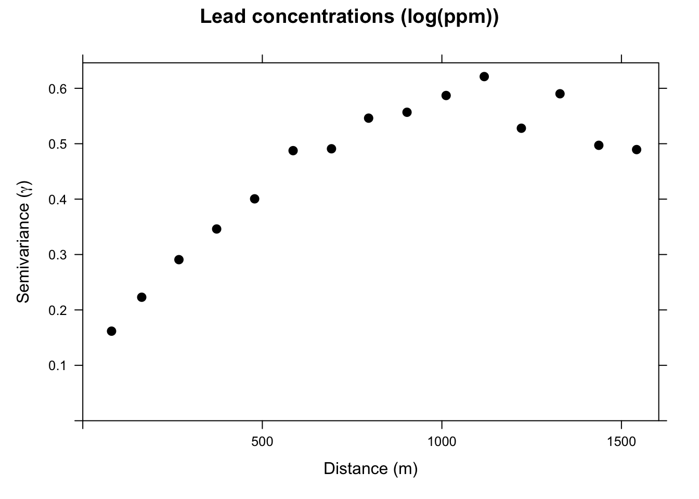
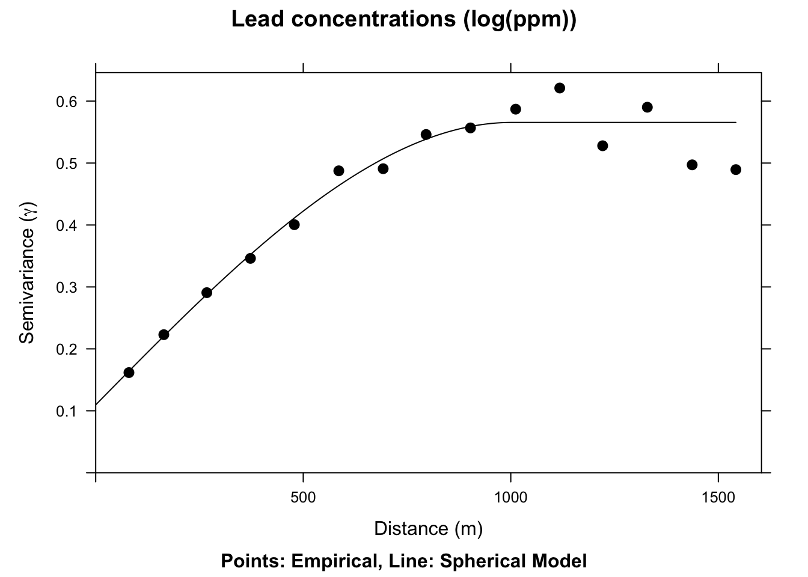
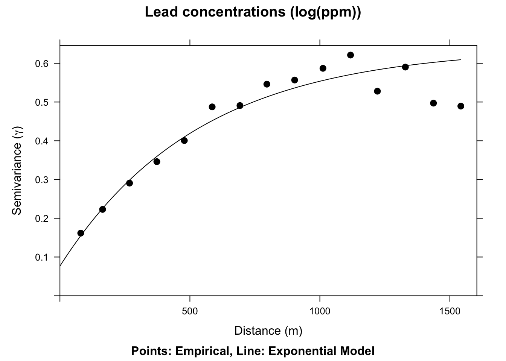
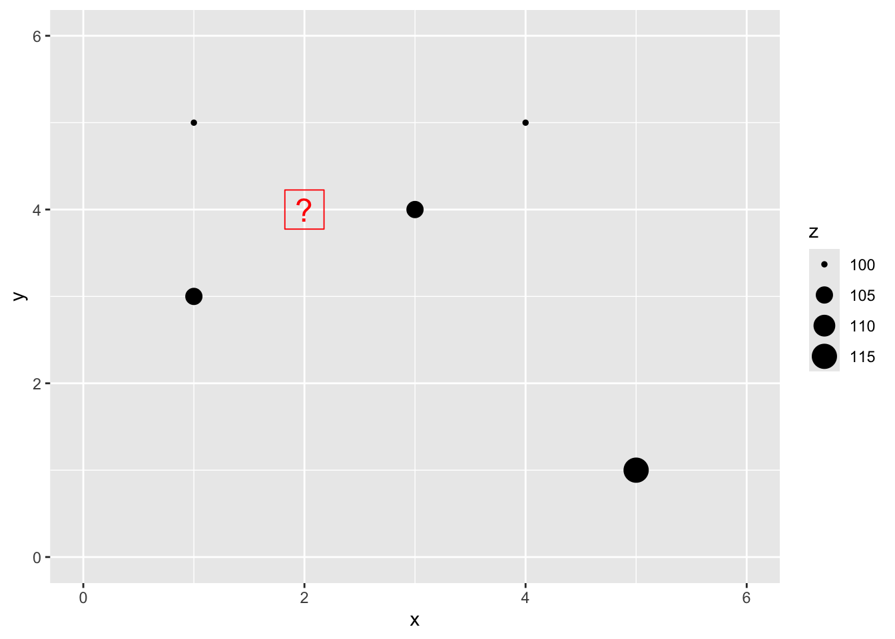
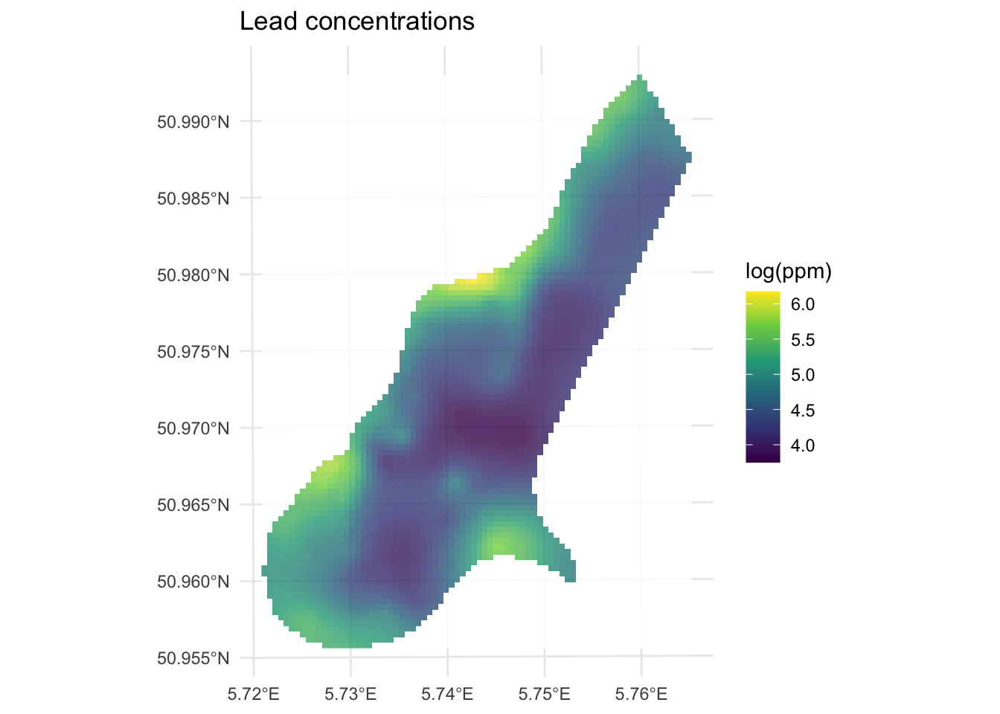
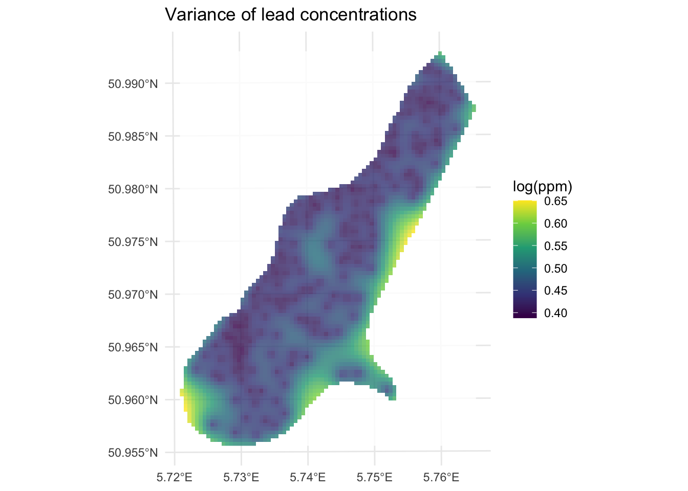
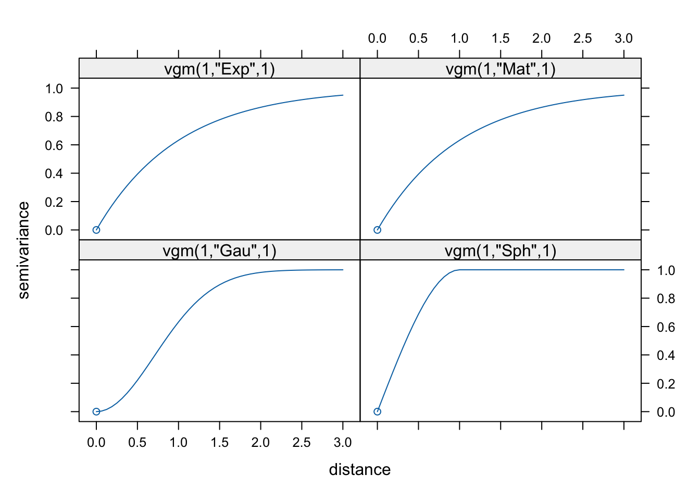
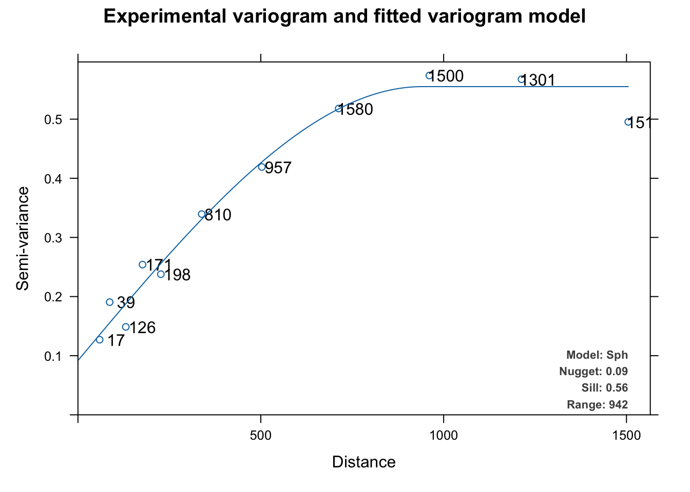

# Probabilistic Interpolation: Kriging


## Reading
We will finish Ch 8 in Bivand (2008). Sections 8.4 and 8.5 are the most important for this module. It's fairly dense after that. Review Fortin (2016) as well, especially 4.3 to 4.5

Bivand R (2008) Interpolation and Geostatistics. In: Applied Spatial Data Analysis with R. Use R!. Springer, New York, NY.

Fortin, M.J., Dale, M.R. and Ver Hoef, J.M. (2016). Spatial Analysis in Ecology. In Wiley StatsRef: Statistics Reference Online (eds N. Balakrishnan, T. Colton, B. Everitt, W. Piegorsch, F. Ruggeri and J.L. Teugels). doi:10.1002/9781118445112.stat07766

## Big Idea
We often want to estimate phenomena at locations where we do not have measurements. Geostatistics is the field that we use to make (hopefully) accurate and reliable models of spatial data. We will use these models for prediction. We can use both deterministic and probabilistic models and this module will focus on probabilistic methods. Kriging is a probabilistic method that finds spatial pattern and predicts unknown values based on that spatial pattern. Unlike IDW, kriging generates a measure of uncertainty allowing us to estimate confidence in the predictions.

## Packages
The `gstat`[@R-gstat] package is your friend. But we will need some of our recent collaborators as well including `sp`[@R-sp] so we can load the `meuse` data easily. And I'm going to plot in `ggplot` via `tidyverse`[@R-tidyverse] with `sf`[@R-sf], `terra`[@R-terra] and `tidyterra`[@R-tidyterra]. 


``` r
library(sp)
library(sf)
library(gstat)
library(tidyverse)
library(terra)
library(tidyterra)
```

## Some Kriging Theory
IDW is a deterministic interpolation method. That is, it relies on a specified mathematical formula that is not a function of the statistical relationship among the known points. This method has no error term associated with it and in fact isn't really geostatistical in a strict sense. Now, you might like to have no error in your estimation but just because IDW doesn't spit out an error term doesn't mean that no error exists. A true geostatistical technique not only produces a prediction surface but also provides some measure of the accuracy of the predictions. Recall how  the names in the IDW objects we calculated had a blank column (`var1.var`)? That's where the error surface will be in addition to the predictions (`var1.pred`) as we move forward with a probabilistic approach to interpolation called Kriging. 

Kriging is a geostatistical method of interpolation that uses spatial autocorrelation -- and it works best when there is strong autocorrelation in the data. When kriging we use the distance between sample points (and sometimes direction) to explain variation in a variable. We then fit a mathematical model to a specified number of points (or points within a certain distance) to determine the output value for each location. 

The approach will make heavy use of the variograms that we started with earlier in the class. They are how we are going to determine the parameter $\lambda$ in the formula for kriging:

$$\hat{Z}(s_0)=\sum_{i=1}^n \lambda_i Z(s_i)$$

where $\hat{Z}$ will be an estimate of a variable at a spatial location $s_0$ where we haven't measured $Z$ and $s_i$ a location, $i$, where we have measured $Z$. There are $n$ measurements. Analogous to the $w$ terms for IDW, $\lambda_i$ is a weight for the measured value at location $s_i$. With IDW the weight was a deterministic function of distance. But with kriging, we use the distance between the measured points and the prediction location as well as the overall spatial structure of the measured points themselves. What is spatial structure? It's the spatial autocorrelation measured by the variogram. Let's review variograms.

## Variogram Redux
Fitting a variogram is also called structural analysis and it is where we calculate the squared difference between the values of pairs of measured points. In the variogram we set this as $\gamma = (z_i-z_j)^2/2$. We then plot $\gamma$ against distance and we have a variogram cloud. In practice the number of pairs (dyads) to calculate and plot gets very large. For $n$ points there are $n \cdot (n-1) / 2$ pairs. So, instead of plotting each pair we average $\gamma$ by distance bins. This is the empirical semivariogram.

We will demonstrate a variogram with the `meuse` data. Here we load the meuse point data and the gridded data as `data.frame`, make a new variable by logging the `lead` column and plot them. This is the same procedure we used when doing IDW.


``` r
# load
data(meuse.all)
data(meuse.grid,package = "sp")

# make a variable to work with
meuse.all$logLead <- log(meuse.all$lead)
# make into sf
meuse_sf <- st_as_sf(meuse.all, coords = c("x", "y")) %>%
  st_set_crs(value = 28992)

meuse_grid_sf <- st_as_sf(meuse.grid, 
                          coords = c("x","y"), 
                          crs = st_crs(meuse_sf))
meuse_grid_sf
```

```
## Simple feature collection with 3103 features and 5 fields
## Geometry type: POINT
## Dimension:     XY
## Bounding box:  xmin: 178460 ymin: 329620 xmax: 181540 ymax: 333740
## Projected CRS: Amersfoort / RD New
## First 10 features:
##    part.a part.b       dist soil ffreq              geometry
## 1       1      0 0.00000000    1     1 POINT (181180 333740)
## 2       1      0 0.00000000    1     1 POINT (181140 333700)
## 3       1      0 0.01222430    1     1 POINT (181180 333700)
## 4       1      0 0.04346780    1     1 POINT (181220 333700)
## 5       1      0 0.00000000    1     1 POINT (181100 333660)
## 6       1      0 0.01222430    1     1 POINT (181140 333660)
## 7       1      0 0.03733950    1     1 POINT (181180 333660)
## 8       1      0 0.05936620    1     1 POINT (181220 333660)
## 9       1      0 0.00135803    1     1 POINT (181060 333620)
## 10      1      0 0.01222430    1     1 POINT (181100 333620)
```

``` r
p1 <- ggplot(data = meuse_sf) +
  geom_sf(aes(fill=logLead), size=4, 
          shape = 21, color="white",alpha=0.8)+
  scale_fill_continuous(type = "viridis",name="log(ppm)") + 
  labs(title="Lead concentrations")
p1
```


We will use the `variogram` function in `gstat`. Look back at the autocorrelation module for review as needed.


``` r
leadVar <- variogram(logLead~1, meuse_sf)
plot(leadVar,pch=20,cex=1.5,col="black",
     ylab=expression("Semivariance ("*gamma*")"),
     xlab="Distance (m)", main = "Lead concentrations (log(ppm))")
```



This is the sample, or empirical, semivariogram. We interpret it as measurements that are closer together (left on the x-axis) have similar values (low values of $\gamma$). As we move to pairs further apart (right on the x-axis) the semivariogram increases; values are more dissimilar and thus have a higher value of $\gamma$. Our next job is going to be to fit a model to the points on the variogram. Before we do that, let's appreciate the three terms for describing the variogram.


* The **range** is the distance beyond which the data are no longer correlated.
* The **sill** is the variance of the variable.
* The **nugget** is the autocorrelation at very small scales. The nugget represents independent error, measurement error and/or micro-scale variation at fine spatial scales. In a continuous variable we would expect that the nugget effect will be zero because at distance zero the values will be the same. However some variables can change in an abrupt manner and so in very short distance there is a difference.

If there is no structure (no correlation) and the variable is therefore a purely random variable, the variogram will be flat with a nugget effect.

## Variogram Model

After plotting the **sample** variogram we can then fit a statistical **model** to the points. The model is a continuous estimate of $\gamma$ as a function of distance: $\hat{\gamma}=f(d)$.  

We will fit two different functions a spherical model and an exponential model. The text has descriptions of the various functions. in practice, we tend to look at the general shape of the plot and then choose a mathematical model that fits.

Note that `gstat` uses the partial sill (`psill`) which is the sill minus the nugget. Just to be confusing. Thanks `gstat`.


``` r
# note our initial estimates for the partial sill, range, and nugget. 
sph.model <- vgm(psill=0.5, model="Sph", range=750, nugget=0.05)
sph.fit <- fit.variogram(object = leadVar, model = sph.model)
sph.fit # look at the fitted values
```

```
##   model     psill    range
## 1   Nug 0.1095742    0.000
## 2   Sph 0.4560318 1002.626
```

``` r
plot(leadVar,model=sph.fit,pch=20,cex=1.5,col="black",
     ylab=expression("Semivariance ("*gamma*")"),
     xlab="Distance (m)", main = "Lead concentrations (log(ppm))",
     sub="Points: Empirical, Line: Spherical Model")
```



We now have a fitted, theoretical, variogram model to the data in the `sph.fit` object. This object took our estimates of the partial sill, range, and nugget and found the best fits from those estimates using non-linear regression. The final parameters are pretty close to our estimates from the plot. E.g., the fitted nugget is 0.11 and the range is 1002.63. If we gave initial estimates way outside the realm of possibility the function wouldn't be able to fit the model. But if the data are well behaved it converges on the best fit pretty easily. If you are too scared to estimate initial values in `vgm` the function will estimate them for you. See Details under `?fit.variogram` for how those are calculated. E.g., in this application if you try `sph.model <- vgm(model="Sph",nugget=TRUE)` the `fit.variogram` algorithm converges without initial estimates.

The actual function for the spherical model is:

$$\hat{\gamma}(d)= b + C_0 \left(1.5\left(\frac{d}{r}\right) - 0.5 \left(\frac{d^3}{r}\right)\right)$$

where $b$ is the nugget, $C_0$ is the sill, $d$ is the distance, and $r$ is the range.

The spherical model above is very commonly used and has nice theoretical properties, using all three classic parameters of the variogram. We could, if we liked, fit some other models -- an exponential model would fit well here too. 


``` r
# note our initial estimates for the sill, range, and nugget
exp.model <- vgm(psill=0.5, model="Exp", range=750, nugget=0.05)
exp.fit <- fit.variogram(object = leadVar, model = exp.model)
plot(leadVar,model=exp.fit,pch=20,cex=1.5,col="black",
     ylab=expression("Semivariance ("*gamma*")"),
     xlab="Distance (m)", main = "Lead concentrations (log(ppm))",
     sub="Points: Empirical, Line: Exponential Model")
```



This model is $\hat{\gamma}(d)=b + C_0(1-e^{-d/a})$ where $a=r/3$ and other terms are as above. 

## Putting it Together
We have a fitted variogram model now. That is $\hat{\gamma}(d)$ or an estimate of spatial structure at any distance. Here is our Kriging formula again:

$$\hat{Z}(s_0)=\sum_{i=1}^n \lambda_i Z(s_i)$$

How do we get to the weights ($\lambda$)? From the variogram model. The guts of this calculation involve a little matrix algebra to fully work through, but conceptually it is pretty simple: 
$$ \lambda = \Gamma^{-1} g $$

where $\Gamma$ is matrix of the semivariance for all sampled point pairs predicted as a function of their Euclidean distance using the fitted variogram model and $g$ is a vector of predicted semivariances for the unknown points using their Euclidean distances from the known points. Once we have $\lambda$ we can interpolate (predict) over a surface for any location where we don't have $Z$. Or, $\hat{Z}(s_0)$.

## Toy Example
Like we did with IDW, let's walk through this calculation with a contrived example.

### Data
Now that we have the information we need on the algorithm, let's do a quick and dirty example by hand to walk through some of the calculations. 

Here is a small data set of five points. We have spatial coordinates ($x$ and $y$) and some measured variable ($z$).

``` r
foo <- data.frame(x = c(1,3,1,4,5),
                  y = c(5,4,3,5,1),
                  z = c(100,105,105,100,115))
foo
```

```
##   x y   z
## 1 1 5 100
## 2 3 4 105
## 3 1 3 105
## 4 4 5 100
## 5 5 1 115
```

``` r
p2 <- ggplot() + 
  geom_point(data=foo,aes(x=x,y=y,size=z)) + 
  lims(x=c(0,6),y=c(0,6))
p2
```


Let's imagine a point $x=2$ and $y=4$ where we don't know $z$.


``` r
p2 <- p2 + 
  geom_point(aes(x=2,y=4),color="red",size=10,shape=0) +
  geom_point(aes(x=2,y=4),color="red",size=6,shape=63)
p2
```



### Interpolate with Kriging
We are now going to use Kriging as a way to get an estimate of that point with a missing value of $z$. Since we are estimating it we call it $\hat{Z}$ and we know the location as $s_0$ so we call this $\hat{Z}(s_0)$. We'll follow the notation above.

The Euclidean distance to our unknown point from each of the known points is a vector: 


$$\mathbf{d_i} = \left[\begin{array}
{rr}
1 & 1.414\\
2 & 1.000\\
3 & 1.414\\
4 & 2.236\\
5 & 4.243
\end{array}\right]$$


To get $\hat{Z}(s_0)$ we need to calculate $\lambda$ and you will recall how we do that, right? We fit a variogram plotting semivariance ($\gamma$) against distance ($d$) and get the function that predicts $\gamma$. Now, these five data points we have don't actually make a nice variogram. So let's suspend disbelief for a moment and I'll tell you that the variogram model is $\hat{\gamma} = 0 + 13.5(d)$. Cool?

How do we get to the weights ($\lambda$)? The guts of this calculation involve a little matrix algebra to fully work through, but conceptually it is pretty simple: 
$$ \lambda = g \Gamma^{-1} $$

where $\Gamma$ is matrix of the semivariance for all sampled point pairs predicted as a function of their Euclidean distance using the fitted variogram model and $g$ is a vector of predicted semivariances for the unknown points using their Euclidean distances from the known points. Once we have $\lambda$ we can now interpolate (predict) over a surface.

First we can calculate $g$ for the point we want to interpolate. We'll do the same point that we did above with IDW. Thus, $g=0 + 13.5(d_i)$: 


$$\mathbf{g} = \left[\begin{array}
{rr}
1 & 19.09\\
2 & 13.50\\
3 & 19.09\\
4 & 30.19\\
5 & 57.28
\end{array}\right]$$

Now, let's get $\Gamma$. First, here is the distance matrix between all the measured points:


$$\mathbf{d} = \left[\begin{array}
{rrrrr}
~ & 1 & 2 & 3 & 4 \\
2 & 2.236 & ~ & ~ & ~ \\
3 & 2.000 & 2.236 & ~ & ~ \\
4 & 3.000 & 1.414 & 3.606 & ~ \\
5 & 5.657 & 3.606 & 4.472 & 4.123
\end{array}\right]$$

We multiply this by the the variogram model $\hat{\gamma}(d)$:


$$\mathbf{\Gamma} = \left[\begin{array}
{rrrrr}
~ & 1 & 2 & 3 & 4 \\
2 & 30.19 & ~ & ~ & ~ \\
3 & 27.00 & 30.19 & ~ & ~ \\
4 & 40.50 & 19.09 & 48.67 & ~ \\
5 & 76.37 & 48.67 & 60.37 & 55.66
\end{array}\right]$$

We now need the inverse of $\Gamma$. Inverting a matrix bigger than say 2x2 is not something I want to do by hand. Inverting a 5x5 matrix by hand would take me all day and I'd definitely screw it up. If you can't recall how to invert a matrix you can check out the always helpful Kahn Academy's take on it [here](https://www.khanacademy.org/math/precalculus/precalc-matrices/intro-to-matrix-inverses/v/inverse-matrix-part-1). In R you can use the `solve` function (or `ginv` in the `MASS` package) to invert a matrix.


$$\mathbf{\Gamma^{-1}} = \left[\begin{array}
{rrrrr}
~ & 1      & 2      & 3      & 4      & 5     \\
1 & -0.023 & 0.005  & 0.017  & 0.009  & 0.000  \\
2 & 0.005  & -0.045 & 0.010  & 0.021  & 0.003  \\
3 & 0.017  & 0.010  & -0.026 & -0.003 & 0.007  \\
4 & 0.009  & 0.021  & -0.003 & -0.027 & 0.007  \\
5 & 0.000  & 0.003  & 0.007  & 0.007  & -0.007
\end{array}\right]$$

And $\lambda = g~\Gamma^{-1}$:
$$\mathbf{\lambda_i} = \left[\begin{array}
{rr}
1 & 0.244\\
2 & 0.491\\
3 & 0.256\\
4 & -0.013\\
5 & -0.028
\end{array}\right]$$


Giving the final prediction:
$$\hat{Z}(s_0)=0.244(100)+0.491(105)+0.256(105)-0.013(100)-0.028(115)=98.3$$

The matrix notation can be sort of tedious but hopefully you've gotten the idea that because of the theoretical variogram model we can estimate $\hat{\gamma}$ for any distance $d$ and use that information with the observed distance matrix to predict $Z$ at any location ($\hat{Z}(s_0)$).

## Application: Kriging a Lead Surface
This will look a lot like what we did with IDW but we will use `krige` instead. And `krige` wants a fitted variogram model to be passed in. So, using the variogram from above we can do this.


``` r
leadVar <- variogram(logLead~1, meuse_sf)
leadModel <- vgm(psill=0.6, model="Sph", range=750, nugget=0.05)
leadFit <- fit.variogram(object = leadVar, model = leadModel)
leadGstat <- gstat(formula = logLead~1, locations = meuse_sf, 
                   model = leadFit)
leadKrige_sf <- predict(leadGstat,newdata = meuse_grid_sf)
```

```
## [using ordinary kriging]
```

``` r
leadKrige_sf
```

```
## Simple feature collection with 3103 features and 2 fields
## Geometry type: POINT
## Dimension:     XY
## Bounding box:  xmin: 178460 ymin: 329620 xmax: 181540 ymax: 333740
## Projected CRS: Amersfoort / RD New
## First 10 features:
##    var1.pred  var1.var              geometry
## 1   5.336713 0.3183947 POINT (181180 333740)
## 2   5.406841 0.2724001 POINT (181140 333700)
## 3   5.343480 0.2854597 POINT (181180 333700)
## 4   5.279198 0.3003649 POINT (181220 333700)
## 5   5.486278 0.2238744 POINT (181100 333660)
## 6   5.415401 0.2377063 POINT (181140 333660)
## 7   5.339935 0.2536512 POINT (181180 333660)
## 8   5.266665 0.2701756 POINT (181220 333660)
## 9   5.562294 0.1801611 POINT (181060 333620)
## 10  5.496279 0.1894106 POINT (181100 333620)
```

Note that `leadKrige` is a `sf` object that has the predicted surface `var1.pred` but there is another surface in there too `var1.var` which contains the variance around those predictions. Let's take a look at the predictions first and then we can think more about how that `var1.var` surface came to be.

Here is the prediction surface. Note how we specify what `attribute` we want to plot to plot via `leadKrige["var1.pred"]`.

I'll use the little function from the IDW notes to get a `rast` object from the `sf` object.

``` r
sf_2_rast <-function(sfObject,variableIndex = 1){
  # coerce sf to a data.frame
  dfObject <- data.frame(st_coordinates(sfObject),
                         z=as.data.frame(sfObject)[,variableIndex])
  # coerce data.frame to SpatRaster
  rastObject <- rast(dfObject,crs=crs(sfObject))
  
  names(rastObject) <- names(sfObject)[variableIndex]
  
  return(rastObject)
}

leadKrige_rast <- sf_2_rast(leadKrige_sf)

leadKrige_rast
```

```
## class       : SpatRaster 
## size        : 104, 78, 1  (nrow, ncol, nlyr)
## resolution  : 40, 40  (x, y)
## extent      : 178440, 181560, 329600, 333760  (xmin, xmax, ymin, ymax)
## coord. ref. : Amersfoort / RD New (EPSG:28992) 
## source(s)   : memory
## name        : var1.pred 
## min value   :  3.749342 
## max value   :  6.174216
```

``` r
# and plot
ggplot() +
  geom_spatraster(data=leadKrige_rast, mapping = aes(fill=var1.pred),alpha=0.8) +
  scale_fill_continuous(type = "viridis",name="log(ppm)",na.value = "transparent") + 
  labs(title="Lead concentrations") +
  theme_minimal()
```




Now let's look at the variance around those predictions. Note we take the square root of `var1.var` to get the uncertainty in the same units as `var1.pred`.


``` r
leadKrige_sf$var1.var.sqrt <- sqrt(leadKrige_sf$var1.var)

leadKrige_rast <- sf_2_rast(leadKrige_sf,variableIndex = 4)
leadKrige_rast
```

```
## class       : SpatRaster 
## size        : 104, 78, 1  (nrow, ncol, nlyr)
## resolution  : 40, 40  (x, y)
## extent      : 178440, 181560, 329600, 333760  (xmin, xmax, ymin, ymax)
## coord. ref. : Amersfoort / RD New (EPSG:28992) 
## source(s)   : memory
## name        : var1.var.sqrt 
## min value   :     0.3881239 
## max value   :     0.6503917
```

``` r
# and plot
ggplot() +
  geom_spatraster(data=leadKrige_rast, mapping = aes(fill=var1.var.sqrt ),alpha=0.8) +
  scale_fill_continuous(type = "viridis",name="log(ppm)",na.value = "transparent") + 
  labs(title="Variance of lead concentrations") +
  theme_minimal()
```




As you can see, kriging generates a measure of error or uncertainty for the predictions. This means that you can estimate confidence in the prediction surface and compare it to a random expectation. How does that all work? Well, it's more than I wanted to get into in the "by hand' calculation above so I'll summarize it below. 

## Uncertainty
The various variogram models we looked at above (i.e., spherical and exponential) and ones we didn't (e.g., Gaussian and Mattern) are more than just pretty lines that we use to get a continuous model of $\hat{\gamma}$ as a function of distance. They have some of the same [properties](https://en.wikipedia.org/wiki/Variogram#Properties) that statistical distributions have in regards to probability theory. In particular, variograms are empirical estimates of the covariance of Gaussian processes. As the model variogram gives the mean of the squared differences between values based on their location, the uncertainty in the variogram at a given distance is the average covariance between "pairs of pairs" used to calculate the variogram. This covariance follows a Gaussian process and thus allows each estimate (prediction) to have an associated error distribution which `gstat` reports as the variance. The underlying theory is well beyond what we cover here but a geostats book like Diggle's ["Model-based Geostatistics"](https://books.google.com/books/about/Model_based_Geostatistics.html?id=qCqOm39OuFUC) will drag you through it. Bivand's chapter has more on this of course and I'll link to a walk through of calculating the uncertainty on a separate page.

## Other Variogram Models
Above I showed you the Gaussian and the exponential variogram models. Those are commonly used as are the Mattern model and the Spherical model. But there are many other options. There are a whole slew actually most of which I've never used. Look at this:


``` r
vgm()
```

```
##    short                                      long
## 1    Nug                              Nug (nugget)
## 2    Exp                         Exp (exponential)
## 3    Sph                           Sph (spherical)
## 4    Gau                            Gau (gaussian)
## 5    Exc        Exclass (Exponential class/stable)
## 6    Mat                              Mat (Matern)
## 7    Ste Mat (Matern, M. Stein's parameterization)
## 8    Cir                            Cir (circular)
## 9    Lin                              Lin (linear)
## 10   Bes                              Bes (bessel)
## 11   Pen                      Pen (pentaspherical)
## 12   Per                            Per (periodic)
## 13   Wav                                Wav (wave)
## 14   Hol                                Hol (hole)
## 15   Log                         Log (logarithmic)
## 16   Pow                               Pow (power)
## 17   Spl                              Spl (spline)
## 18   Leg                            Leg (Legendre)
## 19   Err                   Err (Measurement error)
## 20   Int                           Int (Intercept)
```

`gtsat` knows 20 different possible curves you can fit to your data. E.g.,


``` r
show.vgms(models = c("Exp", "Mat", "Gau", "Sph"))
```



Variogram functions are central to geostatistics and particularly to Kriging. The properties and characteristics of variogram functions that make them well-suited for such applications include:

**Non-Negativity**: Variogram functions must be non-negative, which ensures that the measure of spatial variability (semi-variance) between pairs of points is always a non-negative value. This property is essential.

**Definiteness (Positive Semi-Definiteness)**: For Kriging to produce valid estimates, the variogram must result in a positive semi-definite covariance matrix. This property ensures that the estimated variances are always non-negative, making the Kriging system solvable and ensuring that the weights derived during Kriging are valid and stable.

**Continuity and Differentiability**: Many variogram models are continuous and differentiable, which helps in providing smooth estimates. This is particularly important for interpolation where smooth transitions between estimated values are desirable.

**Model Flexibility**: Different variogram models (spherical, Gaussian, exponential, etc.) offer flexibility in capturing various types of spatial structures. Each model has a different shape and range, allowing them to fit different patterns of spatial correlation:
   - **Spherical Model**: Often used for phenomena where spatial correlation decreases uniformly and becomes zero at a certain range.
   - **Gaussian Model**: Suitable for processes with a high degree of continuity and smooth transitions.
   - **Exponential Model**: Useful for capturing short-range spatial correlations that decrease rapidly with distance.

**Asymptotic Behavior**: Variogram models often approach a sill, representing the maximum variability (or variance) beyond a certain distance (range). This property helps in defining the limit beyond which spatial dependence between points can be considered negligible.

**Practical Interpretability**: Variogram models have parameters (such as nugget, sill, and range) that are interpretable and can be related to the physical characteristics of the spatial process. This interpretability aids in understanding the underlying spatial structure and making informed decisions.

The appropriate choice of a variogram model directly influences the accuracy and reliability of the Kriging estimates. There is no one-size-fits all approach.


## Other Types of Kriging
We are just scratching the surface of what we can do with kriging. Think about what you might do in terms of interpolating in the presence of a trend?  Or how to model anisotropy (see the `anis` argument to `vgm`). As with many topics in this class you could spend a whole quarter on kriging alone.

## Cross Validation
I showed an example of using the built in cross validation function at the end of the last module. We can do the same with kriging. Instead of a straight call to `krige` we can call `krige.cv` for either k-fold or leave-one-out cross validation (LOOCV). It defaults to LOOCV so the predicted values are from the time they were left out the model.


``` r
leadKrigeLOOCV_sf <- krige.cv(formula = logLead~1, 
                           locations = meuse_sf, 
                           model = leadFit, verbose = FALSE)
leadKrigeLOOCV_sf
```

```
## Simple feature collection with 164 features and 6 fields
## Geometry type: POINT
## Dimension:     XY
## Bounding box:  xmin: 178605 ymin: 329714 xmax: 181390 ymax: 333611
## Projected CRS: Amersfoort / RD New
## First 10 features:
##    var1.pred  var1.var observed    residual       zscore fold
## 1   5.402571 0.2277973 5.700444  0.29787270  0.624103170    1
## 2   5.473044 0.2199374 5.624018  0.15097361  0.321922586    2
## 3   5.233697 0.2180910 5.293305  0.05960821  0.127640125    3
## 4   5.077189 0.2520550 4.753590 -0.32359847 -0.644553277    4
## 5   4.794539 0.2134651 4.762174 -0.03236554 -0.070051822    5
## 6   4.584552 0.2571416 4.919981  0.33542860  0.661475718    6
## 7   4.970576 0.2088842 4.882802 -0.08777385 -0.192049137    7
## 8   5.253444 0.2072102 5.010635 -0.24280892 -0.533407471    8
## 9   4.886148 0.1786532 4.890349  0.00420153  0.009940359    9
## 10  4.589513 0.1984181 4.382027 -0.20748612 -0.465798826   10
##                 geometry
## 1  POINT (181072 333611)
## 2  POINT (181025 333558)
## 3  POINT (181165 333537)
## 4  POINT (181298 333484)
## 5  POINT (181307 333330)
## 6  POINT (181390 333260)
## 7  POINT (181165 333370)
## 8  POINT (181027 333363)
## 9  POINT (181060 333231)
## 10 POINT (181232 333168)
```

``` r
# CV R2
cor(leadKrigeLOOCV_sf$observed,leadKrigeLOOCV_sf$var1.pred)^2
```

```
## [1] 0.6192935
```

The LOOCV R$^2$ is 0.6193 which we get from the observed vs predicted values. But note all the fields we get from the `krige.cv` function. We get the prediction and prediction variance of the cross-validated data points and we also get the observed values.  But we also get the residuals (observed minus predicted), the z-score (the residual divided by kriging standard error), and the fold (in this case we have as many folds as rows in meuse because it is LOOCV).

## Your Work
Let's turn again to the California precipitation data that you used for the IDW module. Like with IDW, you'll make a continuous 10x10 km surface of precipitation from the 432 locations of long-term precipitation records. But this time you'll krige the surface rather than use IDW.


``` r
# precip point data
prcpCA <- readRDS("data/prcpCA.rds")
# empty grid to interpolate into
gridCA <- readRDS("data/gridCA.rds")

prcpCAsf <- prcpCA %>% st_as_sf(coords = c("X", "Y")) %>%
  st_set_crs(value = 3310)

prcpCAsf %>% ggplot() + 
  geom_sf(aes(fill=ANNUAL,size=ANNUAL),color="white",
          shape=21,alpha=0.8) + 
  scale_fill_continuous(type = "viridis",name="mm") + 
  labs(title="Total Annual Precipitation") +
  scale_size(guide="none")
```


Use kriging to create a surface of total annual precipitation in California -- do not use `automap` but fit the models using `variogram`, `vgm`, and `fit.variogram` as above. Compare at least two variogram models and assess the surface fit in a sensible way. Interpret and explain your surface and anything you notice in particular about it. 

## Postscript: Automap
You'll find it anyways, so let's get the cat out of the bag.

Like other angry old men, I like to describe a bucolic youth spent milking at 4AM, walking to school in the snow, programming F77 in vi, and **doing all my GIS with Arc on the command line**. Kids these days like to do their geostatistics in ArcGIS by clicking "next, next, next, finish" and plotting their map without `ARCPLOT`. One of the many reasons I like using `R` is that you get to do things like fit variograms by hand the same way the pioneers did when they had to cross the prairie. But you can, if you like, automatically fit a variogram using the `automap` library which has a lot of nice wrappers for the `gstat` functions like `fit.variogram`. 


``` r
library(automap)
leadVar <- autofitVariogram(formula = logLead~1,input_data = meuse_sf)
summary(leadVar)
```

```
## Experimental variogram:
##      np       dist     gamma dir.hor dir.ver   id
## 1    17   59.33470 0.1270576       0       0 var1
## 2    39   86.73182 0.1905754       0       0 var1
## 3   126  130.83058 0.1487020       0       0 var1
## 4   171  176.60188 0.2540911       0       0 var1
## 5   198  226.70319 0.2378083       0       0 var1
## 6   810  338.36102 0.3395189       0       0 var1
## 7   957  502.89504 0.4191339       0       0 var1
## 8  1580  712.92647 0.5180130       0       0 var1
## 9  1500  961.00617 0.5738388       0       0 var1
## 10 1301 1212.86100 0.5675023       0       0 var1
## 11 1517 1504.85947 0.4954516       0       0 var1
## 
## Fitted variogram model:
##   model      psill    range
## 1   Nug 0.09182989   0.0000
## 2   Sph 0.46323373 941.6887
## Sums of squares betw. var. model and sample var.[1] 2.920612e-05
```

``` r
plot(leadVar)
```



This automatically fits and plots a variogram like `fit.variogram` but instead of using user-supplied initial estimates for the model and the parameters, `autofitVariogram` makes these estimates based on the data and then calls `fit.variogram`. The automatic fitting above chose a spherical model like we did above but it tried all the models (exponential, Gaussian, Mattern, etc.) as part of the process.

The biggest difference is that `autofitVariogram` does the bins quite differently than `gstat`'s default behavior with `variogram`. Instead of equal lengths, `autofitVariogram` creates bin of unequal widths. It passes these as the  `boundaries`  argument to `variogram`. You can look at the code for details (`getAnywhere(autofitVariogram)`) but the spirit is to try to get more leverage on the shortest distances to help estimate the wiggliest part of the variogram curve -- esp the nugget. I think it makes sense.

Note that this plot (which is invoked for objects of class `autofitVariogram`) plots the number of point pairs at that distance as well as adds the model terms as a legend. You can look at the code for this plot via `getAnywhere(plot.autofitVariogram)` if you are curious.

And just to complete the whole automation thing, you can automatically apply cross validation as well. Since `autoKrige.cv` calls `krige.cv` to do a lot of the work, it defaults to LOOCV as above.


``` r
leadAutoKrigeLOOCV <- autoKrige.cv(formula = logLead~1, input_data = meuse_sf,
                                   verbose = c(FALSE,FALSE))
summary(leadAutoKrigeLOOCV)
```

```
##             [,1]      
## mean_error  -0.002369 
## me_mean     -0.0004967
## MAE         0.2996    
## MSE         0.1692    
## MSNE        0.8531    
## cor_obspred 0.7901    
## cor_predres 0.04327   
## RMSE        0.4113    
## RMSE_sd     0.6117    
## URMSE       0.4113    
## iqr         0.4022
```

``` r
# R2
cor(leadAutoKrigeLOOCV$krige.cv_output$observed,leadAutoKrigeLOOCV$krige.cv_output$var1.pred)^2
```

```
## [1] 0.6242166
```

Here we get a LOOCV R$^2$ of 0.6242 which is very (very) close to what we got with the cross validation we did manually above.

**Use the tools in `automap` with caution however. Beware the black box.**
