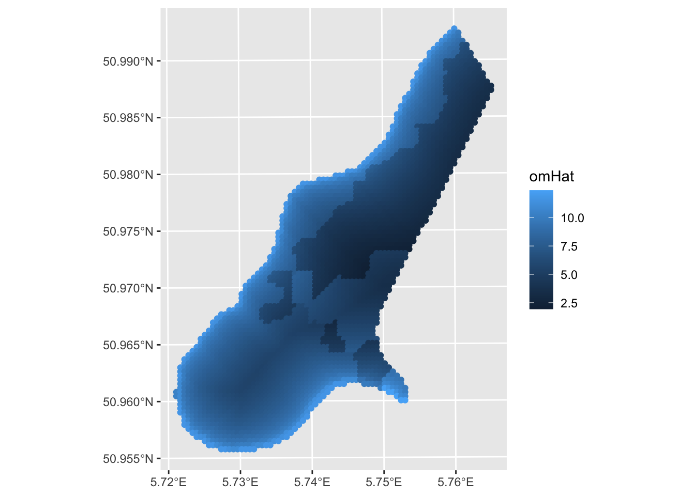
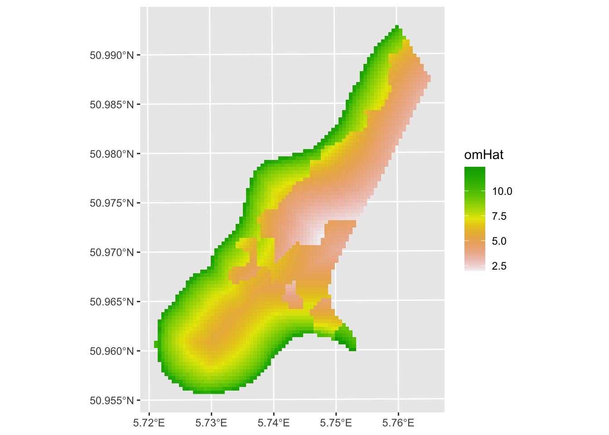
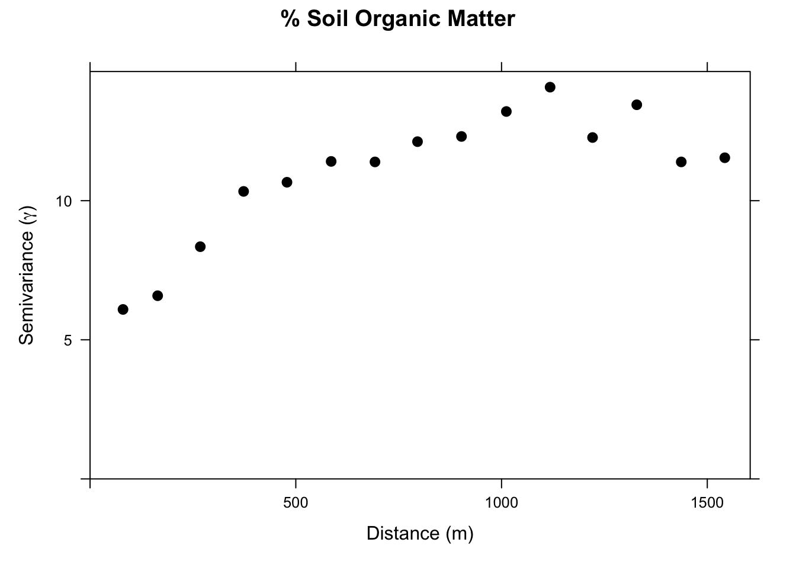
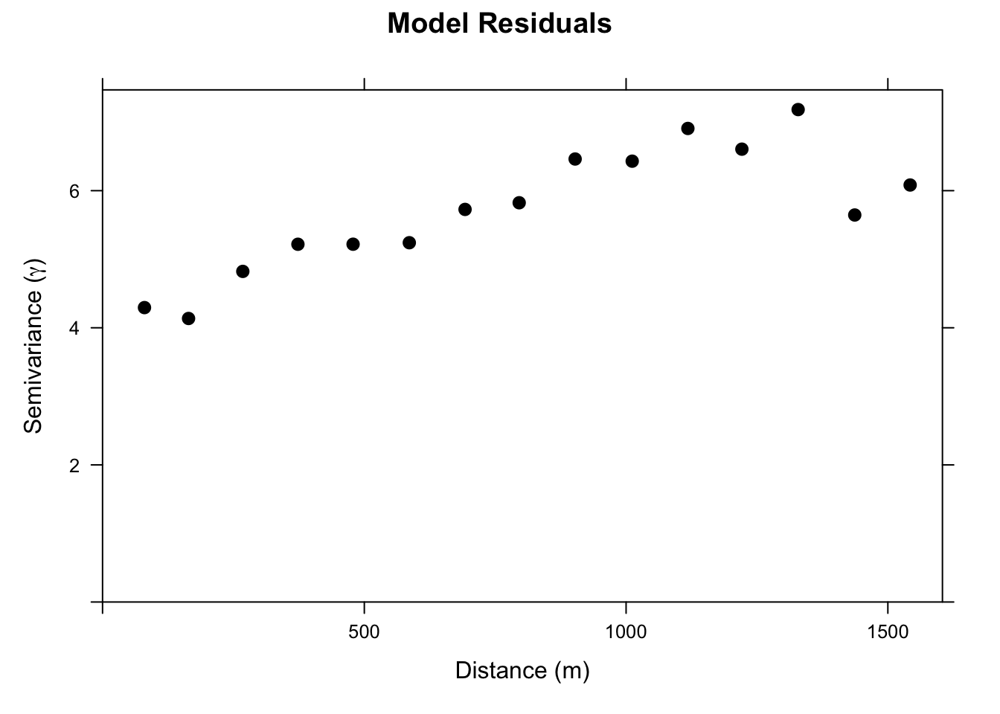
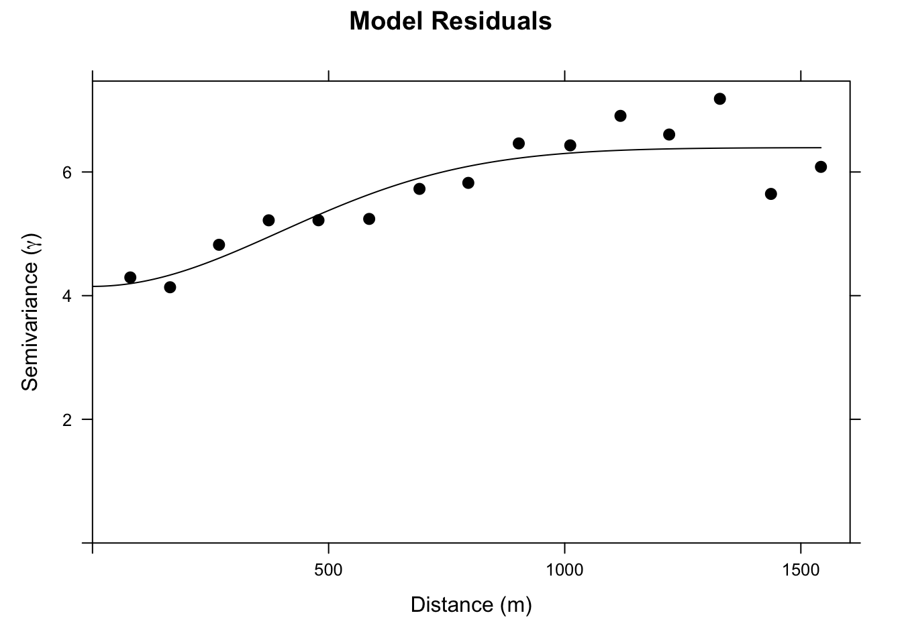
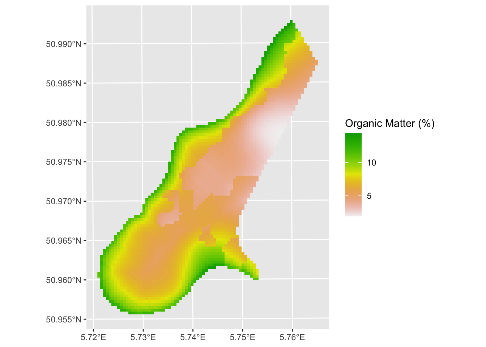
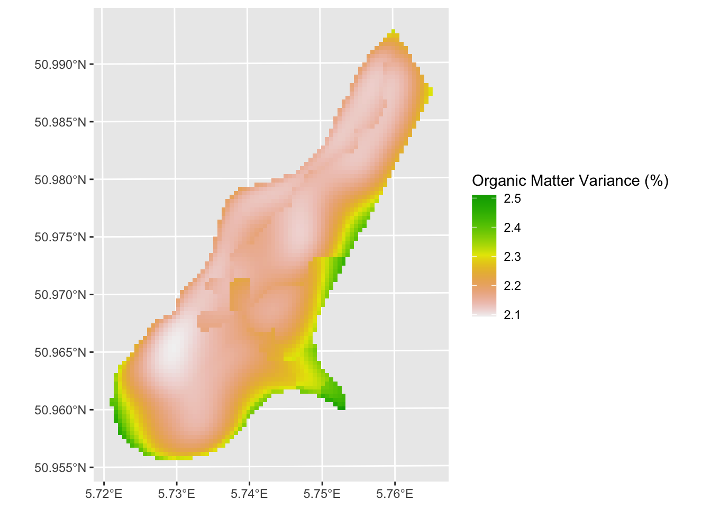

# Probabilistic Interpolation: Regression Kriging


## Big Idea
With kriging we used limited spatial data to make predictions (interpolation) over larger areas. Regression kriging is going to use the same theory but incorporate ancillary data to make better predictions.

## Reading
Meng et al. (2013) provide a (mostly) readable description of regression kriging  and compare it to the kind of interpolation approaches we've looked at already. Give it a heavy skim.

Meng et al. (2013) Assessment of regression kriging for spatial interpolation – comparisons of seven GIS interpolation methods. Cartography and Geographic Information Science, 40:1, 28-39, doi:
10.1080/15230406.2013.762138.

## Packages
The `gstat` package is your friend. But we will need some of our recent collaborators as well including `terra` and `tidyterra'. 


``` r
library(tidyverse)
library(sf)
library(terra)
library(tidyterra)
library(gstat)
```

## Overview of RK
Regression kriging (RK) is a spatial interpolation technique (like IDW, thin-plate splines, and kriging) that allows for estimation of a variable across a spatial domain. Like the name suggests, RK combines regression and kriging. It is a probabilistic method and produces a variance surface like kriging.

RK uses a regression of the dependent variable ($y$) on predictor variables ($x_1$,$x_2$, etc.) with standard kriging of the errors on the regression. By fitting a variogram to the residuals of the model, predictors influence the kriging weights (recall $\lambda$ from the kriging module?). The advantage of RK over either kriging or regression is that it combines the use of spatial structure for prediction (as kriging does) with the addition of ancillary variables (like regression does). In other words, RK exploits the spatial correlation between variables for making predictions.

RK is used more and more commonly as cheap and powerful covariates can be derived from remote sensing and GIS data. I'll give some examples in the video.

## Prediction Review: OLS Regression with New Data
This is likely serious review for all of you so roll your eyes as needed. But I just want to be sure we are on the same page. I want to  make sure you are hip to the idea of passing new data (e.g., into a `predict` function) for extending a model (e.g., `lm`) to new data. We've done this already a few times, but it never hurts to get it again.

Here we create a `data.frame` called `originalDat` with three variables: `x1` and `x2` are `n` draws from a normal distribution ($N(0,1)$) and `y` is a function of `x1`and `x2` following a linear model with coefficients `b0`, `b1`, and `b2` plus some more noise (`epsilon`) ($N(0,2)$).


``` r
n <- 50
b0 <- 4
b1 <- 0.6
b2 <- 3
originalDat <- data.frame(x1=rnorm(n), x2=rnorm(n), epsilon = rnorm(n,sd = 2))
originalDat$y <- b0 + b1 * originalDat$x1 + b2 * originalDat$x2 + originalDat$epsilon
```

We then fit a linear model (OLS) with `lm`:


``` r
lm1 <- lm(y~x1 + x2,data = originalDat)
summary(lm1)
```

```
## 
## Call:
## lm(formula = y ~ x1 + x2, data = originalDat)
## 
## Residuals:
##     Min      1Q  Median      3Q     Max 
## -3.9446 -1.4464 -0.3522  1.2004  4.5087 
## 
## Coefficients:
##             Estimate Std. Error t value Pr(>|t|)    
## (Intercept)   3.5699     0.2841  12.567  < 2e-16 ***
## x1            0.4794     0.2650   1.809   0.0768 .  
## x2            2.8109     0.3556   7.904 3.55e-10 ***
## ---
## Signif. codes:  0 '***' 0.001 '**' 0.01 '*' 0.05 '.' 0.1 ' ' 1
## 
## Residual standard error: 1.968 on 47 degrees of freedom
## Multiple R-squared:  0.5788,	Adjusted R-squared:  0.5609 
## F-statistic: 32.29 on 2 and 47 DF,  p-value: 1.497e-09
```

OK. We have one definitely helpful predictor, and one borderline predictor. Now let's say we want to extend that model to predict a new data set. The object `lm1` is class `lm` and most every model class has a `predict` function, or a `newdata` argument to the original function, that allows you feed it new data. So let's imagine we have a new data set with  `x1` and `x2` but no `y`. 


``` r
newDat <- data.frame(x1=rnorm(n),x2=rnorm(n))
head(newDat)
```

```
##           x1         x2
## 1 -0.9107046  0.1053673
## 2 -1.9548906 -0.2345276
## 3 -0.5561183  0.1375432
## 4 -0.7254766  0.3132995
## 5 -0.5021313  1.1485350
## 6  0.1749991  0.8071396
```

We can use `predict.lm` (we just need to type `predict` since the object we are feeding is class `lm`, R knows to use `predict.lm`) to model new estimates of `y` by pointing to `newDat` using the `newdata` argument. Note that I'm sticking the predicted values right into a new column `yhat`. Why the hat? Because it's an estimate.


``` r
newDat$yhat <- predict(object = lm1,newdata = newDat)
head(newDat)
```

```
##           x1         x2     yhat
## 1 -0.9107046  0.1053673 3.429497
## 2 -1.9548906 -0.2345276 1.973452
## 3 -0.5561183  0.1375432 3.689944
## 4 -0.7254766  0.3132995 4.102786
## 5 -0.5021313  1.1485350 6.557656
## 6  0.1749991  0.8071396 5.922660
```

If we call `predict` without new data, the fits from the original model are returned. In the above `predict(lm1)`, `fitted(lm1)`, and `lm1$fitted.values` all do the same thing.


I know that most of you are familiar with this. I just wanted to spell it all out.

## Back to the Netherlands

Let's look at a real-world example of RK using, you guessed it, the Meuse River data. I'm pretty sick of these data but they are familiar to us. We've used the data in `meuse.all` quite a bit and we've used `meuse.grid` as an empty grid to interpolate into. But `meuse.grid` has other data in it that we can use in a regression kriging approach.

### The Data


``` r
data(meuse.all)
str(meuse.all)
```

```
## 'data.frame':	164 obs. of  17 variables:
##  $ sample     : num  1 2 3 4 5 6 7 8 9 10 ...
##  $ x          : num  181072 181025 181165 181298 181307 ...
##  $ y          : num  333611 333558 333537 333484 333330 ...
##  $ cadmium    : num  11.7 8.6 6.5 2.6 2.8 3 3.2 2.8 2.4 1.6 ...
##  $ copper     : num  85 81 68 81 48 61 31 29 37 24 ...
##  $ lead       : num  299 277 199 116 117 137 132 150 133 80 ...
##  $ zinc       : num  1022 1141 640 257 269 ...
##  $ elev       : num  7.91 6.98 7.8 7.66 7.48 ...
##  $ dist.m     : num  50 30 150 270 380 470 240 120 240 420 ...
##  $ om         : num  13.6 14 13 8 8.7 7.8 9.2 9.5 10.6 6.3 ...
##  $ ffreq      : num  1 1 1 1 1 1 1 1 1 1 ...
##  $ soil       : num  1 1 1 2 2 2 2 1 1 2 ...
##  $ lime       : num  1 1 1 0 0 0 0 0 0 0 ...
##  $ landuse    : Factor w/ 16 levels "Aa","Ab","Ag",..: 4 4 4 11 4 11 4 2 2 16 ...
##  $ in.pit     : logi  FALSE FALSE FALSE FALSE FALSE FALSE ...
##  $ in.meuse155: logi  TRUE TRUE TRUE TRUE TRUE TRUE ...
##  $ in.BMcD    : logi  FALSE FALSE FALSE FALSE FALSE FALSE ...
```
We know all too well by now that `meuse.all` is a `data.frame` with 164 point measurements of 17 variables. 


``` r
meuse.grid <- readRDS("data/meuse.grid.Rds")
str(meuse.grid)
```

```
## 'data.frame':	3103 obs. of  7 variables:
##  $ x     : num  181180 181140 181180 181220 181100 ...
##  $ y     : num  333740 333700 333700 333700 333660 ...
##  $ part.a: num  1 1 1 1 1 1 1 1 1 1 ...
##  $ part.b: num  0 0 0 0 0 0 0 0 0 0 ...
##  $ dist  : num  0 0 0.0122 0.0435 0 ...
##  $ soil  : Factor w/ 3 levels "1","2","3": 1 1 1 1 1 1 1 1 1 1 ...
##  $ ffreq : Factor w/ 3 levels "1","2","3": 1 1 1 1 1 1 1 1 1 1 ...
```

And, we know all too well by now that `meuse.grid` is a `data.frame` with 3103 points on a grid and 7 variables. 

However, we have three variables from `meuse.all` that overlap in `meuse.grid` and we haven't used those much (or at all) in this class yet. Thus, if we create a model from `meuse.all` that includes `dist`, `soil`, or `ffreq` as predictors we could predict over `meuse.grid` without doing IDW or kriging. Those variables held in common between `meuse.all` and `meuse.grid` are, by the way, the distance to the river (normalized from 0 to 1), soil type (three classes), and the flooding frequency class (also three classes). See `?meuse.all` for details on the variables.

Don't worry, we will skip cadmium, zinc, and lead and work with modeling `om` which is percent organic matter in the soil. We will model `om` as a function of `dist` and `soil` and predict it over the entire study site. We will do this naively with ordinary least squares regression (OLS) and then again with RK.


### Make data as `sf` and clean it up
Fist we will make both data sets in `sf` objects.


``` r
meusePoints_sf <- st_as_sf(meuse.all,coords = c("x","y"), crs=28992)
meuseGrid_sf <- st_as_sf(meuse.grid,coords = c("x","y"), crs=28992)
meusePoints_sf
```

```
## Simple feature collection with 164 features and 15 fields
## Geometry type: POINT
## Dimension:     XY
## Bounding box:  xmin: 178605 ymin: 329714 xmax: 181390 ymax: 333611
## Projected CRS: Amersfoort / RD New
## First 10 features:
##    sample cadmium copper lead zinc  elev dist.m   om ffreq soil lime landuse
## 1       1    11.7     85  299 1022 7.909     50 13.6     1    1    1      Ah
## 2       2     8.6     81  277 1141 6.983     30 14.0     1    1    1      Ah
## 3       3     6.5     68  199  640 7.800    150 13.0     1    1    1      Ah
## 4       4     2.6     81  116  257 7.655    270  8.0     1    2    0      Ga
## 5       5     2.8     48  117  269 7.480    380  8.7     1    2    0      Ah
## 6       6     3.0     61  137  281 7.791    470  7.8     1    2    0      Ga
## 7       7     3.2     31  132  346 8.217    240  9.2     1    2    0      Ah
## 8       8     2.8     29  150  406 8.490    120  9.5     1    1    0      Ab
## 9       9     2.4     37  133  347 8.668    240 10.6     1    1    0      Ab
## 10     10     1.6     24   80  183 9.049    420  6.3     1    2    0       W
##    in.pit in.meuse155 in.BMcD              geometry
## 1   FALSE        TRUE   FALSE POINT (181072 333611)
## 2   FALSE        TRUE   FALSE POINT (181025 333558)
## 3   FALSE        TRUE   FALSE POINT (181165 333537)
## 4   FALSE        TRUE   FALSE POINT (181298 333484)
## 5   FALSE        TRUE   FALSE POINT (181307 333330)
## 6   FALSE        TRUE   FALSE POINT (181390 333260)
## 7   FALSE        TRUE   FALSE POINT (181165 333370)
## 8   FALSE        TRUE   FALSE POINT (181027 333363)
## 9   FALSE        TRUE   FALSE POINT (181060 333231)
## 10  FALSE        TRUE   FALSE POINT (181232 333168)
```

``` r
meuseGrid_sf
```

```
## Simple feature collection with 3103 features and 5 fields
## Geometry type: POINT
## Dimension:     XY
## Bounding box:  xmin: 178460 ymin: 329620 xmax: 181540 ymax: 333740
## Projected CRS: Amersfoort / RD New
## First 10 features:
##    part.a part.b       dist soil ffreq              geometry
## 1       1      0 0.00000000    1     1 POINT (181180 333740)
## 2       1      0 0.00000000    1     1 POINT (181140 333700)
## 3       1      0 0.01222430    1     1 POINT (181180 333700)
## 4       1      0 0.04346780    1     1 POINT (181220 333700)
## 5       1      0 0.00000000    1     1 POINT (181100 333660)
## 6       1      0 0.01222430    1     1 POINT (181140 333660)
## 7       1      0 0.03733950    1     1 POINT (181180 333660)
## 8       1      0 0.05936620    1     1 POINT (181220 333660)
## 9       1      0 0.00135803    1     1 POINT (181060 333620)
## 10      1      0 0.01222430    1     1 POINT (181100 333620)
```

One thing to note here is that the `dist.m` column in `meusePoints_sf` is the distance to the river in meters while `meuseGrid_sf` has distance to the river in relative units (scaled zero to one). To make life easier we will add the relative distances to the point data unsing the `dist` values from `meuseGrid_sf`.


``` r
# get the relative distance from meuseGrid_sf and add it to meusePoints_sf
meuseGrid_dist_sf <- meuseGrid_sf %>% select(dist)
# join the two objects by the nearest point
meusePoints_sf <- st_join(meusePoints_sf,meuseGrid_dist_sf, join = st_nearest_feature)
# note that we now have relative dist for each point now in the column `dist`
meusePoints_sf
```

```
## Simple feature collection with 164 features and 16 fields
## Geometry type: POINT
## Dimension:     XY
## Bounding box:  xmin: 178605 ymin: 329714 xmax: 181390 ymax: 333611
## Projected CRS: Amersfoort / RD New
## First 10 features:
##    sample cadmium copper lead zinc  elev dist.m   om ffreq soil lime landuse
## 1       1    11.7     85  299 1022 7.909     50 13.6     1    1    1      Ah
## 2       2     8.6     81  277 1141 6.983     30 14.0     1    1    1      Ah
## 3       3     6.5     68  199  640 7.800    150 13.0     1    1    1      Ah
## 4       4     2.6     81  116  257 7.655    270  8.0     1    2    0      Ga
## 5       5     2.8     48  117  269 7.480    380  8.7     1    2    0      Ah
## 6       6     3.0     61  137  281 7.791    470  7.8     1    2    0      Ga
## 7       7     3.2     31  132  346 8.217    240  9.2     1    2    0      Ah
## 8       8     2.8     29  150  406 8.490    120  9.5     1    1    0      Ab
## 9       9     2.4     37  133  347 8.668    240 10.6     1    1    0      Ab
## 10     10     1.6     24   80  183 9.049    420  6.3     1    2    0       W
##    in.pit in.meuse155 in.BMcD       dist              geometry
## 1   FALSE        TRUE   FALSE 0.00135803 POINT (181072 333611)
## 2   FALSE        TRUE   FALSE 0.01222430 POINT (181025 333558)
## 3   FALSE        TRUE   FALSE 0.10302900 POINT (181165 333537)
## 4   FALSE        TRUE   FALSE 0.19009400 POINT (181298 333484)
## 5   FALSE        TRUE   FALSE 0.27709000 POINT (181307 333330)
## 6   FALSE        TRUE   FALSE 0.36406700 POINT (181390 333260)
## 7   FALSE        TRUE   FALSE 0.19009400 POINT (181165 333370)
## 8   FALSE        TRUE   FALSE 0.09215160 POINT (181027 333363)
## 9   FALSE        TRUE   FALSE 0.18461400 POINT (181060 333231)
## 10  FALSE        TRUE   FALSE 0.30970200 POINT (181232 333168)
```

We will go a step further and use the square root of the distance to the river as a predictor. This just helps us get a little more leverage on very short distances by stretching out the scale.


``` r
meusePoints_sf <- meusePoints_sf %>% mutate(sqrt_dist = sqrt(dist))
meuseGrid_sf <- meuseGrid_sf %>% mutate(sqrt_dist = sqrt(dist))
```

Next, the column `om` in `meusePoints_sf` has two missing data points (`NA`) in it. I'm going to toss those rows to make things easier. Note the new number of rows in `meusePoints_sf` after you run this.


``` r
meusePoints_sf <- meusePoints_sf %>% drop_na(om)
```

And finally, we are going to be using the soil type as a predictor. That is a categorical variable so we need to change it to be a `factor`.


``` r
meusePoints_sf <- meusePoints_sf %>% mutate(soil = factor(soil))
meuseGrid_sf <- meuseGrid_sf %>% mutate(soil = factor(soil))
```

### OLS
We will make a simple model of organic matter ($y$) as a function of the square root of the distance to the river ($x_1$) and soil type ($x_2$): $y=\beta_0 + \beta_1x_1+\beta_2x_2$. The parameters ($\beta_{0,1,2}$) will be estimated with OLS. 
Here is the OLS model:


``` r
om_lm <- lm(om~sqrt_dist+soil, data=meusePoints_sf)
summary(om_lm)
```

```
## 
## Call:
## lm(formula = om ~ sqrt_dist + soil, data = meusePoints_sf)
## 
## Residuals:
##     Min      1Q  Median      3Q     Max 
## -6.8478 -1.4629 -0.1575  1.4344  7.3786 
## 
## Coefficients:
##             Estimate Std. Error t value Pr(>|t|)    
## (Intercept)  11.6894     0.4418  26.460  < 2e-16 ***
## sqrt_dist    -8.9179     1.0902  -8.180 8.79e-14 ***
## soil2        -1.7178     0.5047  -3.403 0.000843 ***
## soil3         0.7120     0.8628   0.825 0.410449    
## ---
## Signif. codes:  0 '***' 0.001 '**' 0.01 '*' 0.05 '.' 0.1 ' ' 1
## 
## Residual standard error: 2.473 on 158 degrees of freedom
## Multiple R-squared:  0.4926,	Adjusted R-squared:  0.4829 
## F-statistic: 51.12 on 3 and 158 DF,  p-value: < 2.2e-16
```

``` r
anova(om_lm)
```

```
## Analysis of Variance Table
## 
## Response: om
##            Df Sum Sq Mean Sq F value    Pr(>F)    
## sqrt_dist   1 833.08  833.08 136.197 < 2.2e-16 ***
## soil        2 105.07   52.54   8.589 0.0002877 ***
## Residuals 158 966.45    6.12                      
## ---
## Signif. codes:  0 '***' 0.001 '**' 0.01 '*' 0.05 '.' 0.1 ' ' 1
```

In our model, we see that both distance and soil types are good predictors of organic matter percent. Now, this might or might not be a good model. After you learn about the pitfalls of using OLS with spatial data you'll be appalled that I'm running this model and not checking for spatial autocorrelation in the residuals or doing any other regression diagnostics. But suppress your horror for now. Because all I want to do here is show how I could (if I wanted to live in a state of ignorant bliss) predict this model across the landscape.


``` r
meuseGrid_sf$omHat <- predict(om_lm, newdata=meuseGrid_sf)

ggplot() + geom_sf(data = meuseGrid_sf,mapping = aes(color=omHat))
```




A few things. One this is a decent prediction. The model relatively skillful (but we should crossvalidate it) but the assumption about independence of the residuals is violated. E.g., Moran's I on an eight-neighbor object is 0.23 which is significantly greater than zero. More on that in the next set of notes "GLS with Autocorrelated Residuals." Oh, and that plot above is all points. We can make it a raster. Remember this handy function from the prior weeks that makes a `sf` point object into a `SpatRaster`?


``` r
sf_2_rast <-function(sfObject,variable2get = 1){
  # coerce sf to a data.frame
  tmp <- sfObject[,variable2get] %>% st_drop_geometry()
  dfObject <- data.frame(st_coordinates(sfObject),
                         z=tmp)
  # coerce data.frame to SpatRaster
  rastObject <- rast(dfObject,crs=crs(sfObject))
  
  return(rastObject)
}

meuseGrid_rast <- sf_2_rast(meuseGrid_sf,variable2get = "omHat")
ggplot() + geom_spatraster(data = meuseGrid_rast,
                           mapping = aes(fill=omHat)) +
  scale_fill_terrain_c() +
  labs(fill = "omHat")
```



### RK Application
As I imagine you have anticipated, the silliest thing in the model above is that we threw out all of the awesome data we have on spatial structure. All the information on how pairs of samples relate to each other in terms of semivariance has been cast aside. And we know that organic matter is autocorrelated. E.g.,:

``` r
omVar <- variogram(om~1, meusePoints_sf)
plot(omVar,pch=20,cex=1.5,col="black",
     ylab=expression("Semivariance ("*gamma*")"),
     xlab="Distance (m)", main = "% Soil Organic Matter")
```



With kriging, we would interpolate a surface based just on a theoretical variogram we would fit to those data. But we have all the data on distance and soil type that we used in the OLS model above. We can combine these approaches with RK.

We will set up a `gstat` object with the linear regression model. When we plot the variogram we are seeing the residuals from that regression. They have some spatial structure. In OLS that is bad (violates independence). For RK, this is good! It means we can use that structure to improve the prediction.


``` r
omGstat <- gstat(id = "omModel", formula = om ~ sqrt_dist + soil, 
                 data = meusePoints_sf)
omGstat_obsVariogram <- variogram(omGstat)
plot(omGstat_obsVariogram,pch=20,cex=1.5,col="black",
     ylab=expression("Semivariance ("*gamma*")"),
     xlab="Distance (m)", main = "Model Residuals")
```



Ok. Let's look at this. It's not a severe variogram. But you can see that the semivariance goes from a nugget of about four to a sill of about six. I.e., there is spatial structure in this model that we can leverage and that should improve our predictions.

Thus, let's fit a theoretical model to the `omGstat_obsVariogram` variogram. I'll use a Gaussian model but you could make a good case here for an Exponential model.


``` r
omGau_fittedVariogram <- fit.variogram(omGstat_obsVariogram, vgm(psill = 6, model = "Gau", range = 500, nugget = 4))

plot(omGstat_obsVariogram, omGau_fittedVariogram,pch=20,cex=1.5,col="black",
     ylab=expression("Semivariance ("*gamma*")"),
     xlab="Distance (m)", main = "Model Residuals")
```



Now we can update the `gstat` object with that variogram model. And use it to make a prediction.


``` r
# Update the gstat object with the variogram:
omGstat_w_variogram <- gstat(omGstat, id="omModel", model=omGau_fittedVariogram)
# And predict
omHat_sf <- predict(omGstat_w_variogram, newdata = meuseGrid_sf)
```

```
## [using universal kriging]
```

``` r
omHat_sf
```

```
## Simple feature collection with 3103 features and 2 fields
## Geometry type: POINT
## Dimension:     XY
## Bounding box:  xmin: 178460 ymin: 329620 xmax: 181540 ymax: 333740
## Projected CRS: Amersfoort / RD New
## First 10 features:
##    omModel.pred omModel.var              geometry
## 1      14.33925    5.370485 POINT (181180 333740)
## 2      14.38783    5.207100 POINT (181140 333700)
## 3      13.21201    5.157301 POINT (181180 333700)
## 4      12.16400    5.172975 POINT (181220 333700)
## 5      14.40786    5.072085 POINT (181100 333660)
## 6      13.24575    5.008216 POINT (181140 333660)
## 7      12.37960    5.012550 POINT (181180 333660)
## 8      11.85536    5.056316 POINT (181220 333660)
## 9      13.99688    4.937390 POINT (181060 333620)
## 10     13.24907    4.889661 POINT (181100 333620)
```

We have made a new object `omHat_sf` that has the predictions and the variance from the RK. It's an `sf` object (because `meuseGridSF` is also `sf`). Let's make them into `SpatRasers` to make the plots prettier. 


``` r
omHat_rast <- sf_2_rast(omHat_sf,variable2get = "omModel.pred")
omHat_rast
```

```
## class       : SpatRaster 
## size        : 104, 78, 1  (nrow, ncol, nlyr)
## resolution  : 40, 40  (x, y)
## extent      : 178440, 181560, 329600, 333760  (xmin, xmax, ymin, ymax)
## coord. ref. : Amersfoort / RD New (EPSG:28992) 
## source(s)   : memory
## name        : omModel.pred 
## min value   :     1.891323 
## max value   :    14.407855
```

And plot:


``` r
ggplot() + 
  geom_spatraster(data = omHat_rast,
                           mapping = aes(fill=omModel.pred)) +
  scale_fill_terrain_c() +
  labs(fill = "Organic Matter (%)")
```



And variance around the predictions:


``` r
omHatVar_rast <- sf_2_rast(omHat_sf,variable2get = "omModel.var")
# take the square root of variance to create standard deviation (units match then)
omHatVar_rast <- omHatVar_rast %>% mutate(omModel.var.sqrt = sqrt(omModel.var))
ggplot() + geom_spatraster(data = omHatVar_rast,
                           mapping = aes(fill=omModel.var.sqrt)) +
  scale_fill_terrain_c() +
  labs(fill = "Organic Matter Variance (%)")
```



The RK approach looks quite a bit different than the OLS prediction. Now our job is to look at the differences carefully and assess skill. 

## Your Work
None. This is kind of an add on to introduce you to RK. But you should be able to apply by following the workflow above. I suggest taking some time to figure out how to use `gstat.cv` and perform k-fold cross validation on the `omGstat_w_variogram` object and object with just the linear model (`omGstat`). Compare the skill of a k-fold cross validated OLS model and the k-fold cross validated RK model. Use R$^2$ and RMSE as your measures of skill. Did the RK approach improve the predictions?


