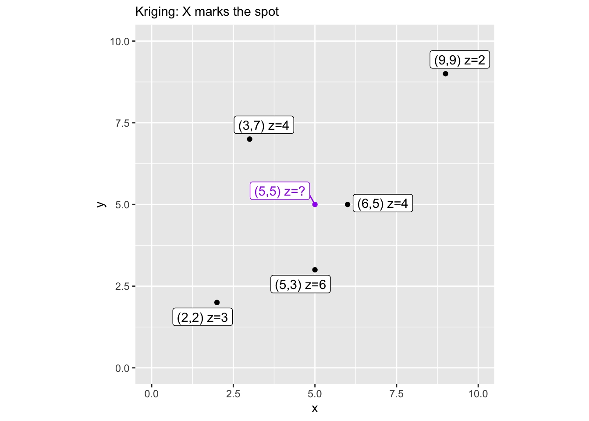
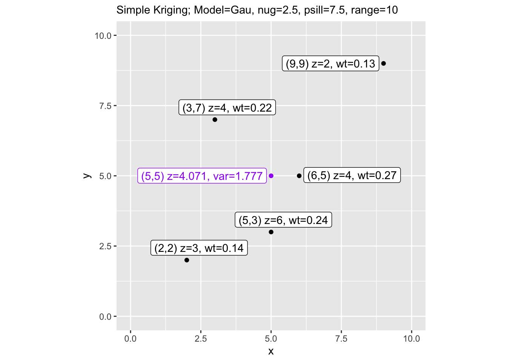
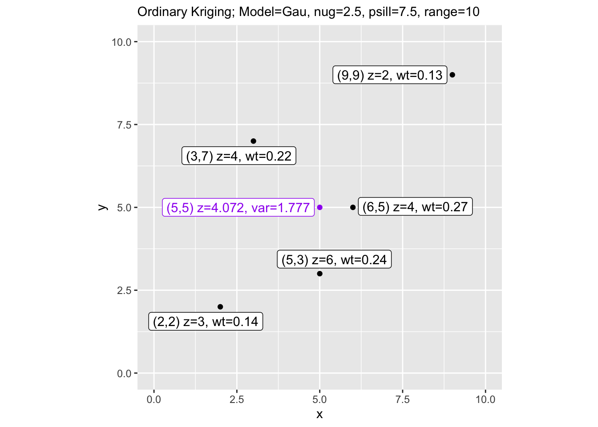

# Aside: Geostats II: Kriging Variance By Hand {- .aside-chapter}


## Calculating Variance By Hand

This is a very quick adaptation of calculating the variance in kriging by hand. This came from used Prof Ashton Shortridge at MSU and he gave me permission to share this with you. It was hosted on his univ web page but as he told me:

"Unfortunately MSU, in its wisdom, decided to eliminate home pages, and I have had to move to our course management software...When I have time (hah!), I'd like to post the course stuff somewhere public. For now I'll just pass along the updated manual kriging pages - feel free to use as you see fit."

What a cool guy!

So, here is an example of how to get the variance on ordinary and simple kriging by hand if you want to go down this particular rabbit hole. There is nothing specifically for you to do here, but I think it's fun to work through these calculations manually. But I'm odd like that.


``` r
#################################################################
#
# Manual krig example: code for manual simple and ordinary 
# kriging using the coordinates in Box 6.2 in Burrough & 
# McDonnell, Principles of GIS (1998). However, 
# results are a bit different, as there was a typo in the book.
#  written by A. Shortridge 3/2004, 3/2007, 10/2013, 10/2014
#
#################################################################


#################################################################
#
# Covar funcs for spherical, exponential, and Gaussian models
#
# Given a set of parameters and a matrix of distances, these 
# functions will spit out covariances.
#
#################################################################

spher.covar <- function(dist, nugget, sill, range) {
   sigma <- sill + nugget
   # Covariance(h) = Sigma + Gamma(h)
   covar <- matrix(0, nrow=nrow(dist), ncol=ncol(dist))
   for (i in 1:nrow(covar)) {
      for (j in 1:ncol(covar)) {
         if (dist[i,j] > range) 
            covar[i,j] <- 0
         else if (dist[i,j] == 0)
            covar[i,j] <- sigma
         else covar[i,j] <- sigma - (nugget + (sigma - nugget) * 
                                        (((3*dist[i,j])/(2*range)) - ((dist[i,j]^3)/(2*range^3))))
      }
   }
   return(covar)
}


exp.covar <- function(dist, nugget, sill, range) {
   sigma <- sill + nugget
   covar <- matrix(0, nrow=nrow(dist), ncol=ncol(dist))
   for (i in 1:nrow(covar)) {
      for (j in 1:ncol(covar)) {
         if (dist[i,j] == 0) {
            covar[i,j] <- sigma
         }
         else 
            covar[i,j] <- sill * exp(-dist[i,j]/range)
      }
   }
   return(covar)
}


gauss.covar <- function(dist, nugget, sill, range) {
   sigma <- sill + nugget
   covar <- matrix(0, nrow=nrow(dist), ncol=ncol(dist))
   for (i in 1:nrow(covar)) {
      for (j in 1:ncol(covar)) {
         if (dist[i,j] == 0) {
            covar[i,j] <- sigma
         }
         else 
            covar[i,j] <- sill * exp(-dist[i,j]^2/range^2)
      }
   }
   return(covar)
}


#################################################################
#
# Worked example
#
#################################################################

library(gstat)
library(fields)
```

```
## Loading required package: spam
```

```
## Spam version 2.11-3 (2026-01-05) is loaded.
## Type 'help( Spam)' or 'demo( spam)' for a short introduction 
## and overview of this package.
## Help for individual functions is also obtained by adding the
## suffix '.spam' to the function name, e.g. 'help( chol.spam)'.
```

```
## 
## Attaching package: 'spam'
```

```
## The following objects are masked from 'package:base':
## 
##     backsolve, forwardsolve
```

```
## Loading required package: viridisLite
```

```
## Loading required package: RColorBrewer
```

```
## 
## Try help(fields) to get started.
```

``` r
library(ggplot2)
library(ggrepel)

## Set up data and distance matrix/vector
dat <- data.frame(x=c(2,3,9,6,5),y=c(2,7,9,5,3), z=c(3,4,2,4,6))
dmat <- round(rdist(cbind(dat$x,dat$y)), digits=4)  # covariance matrix
dvec <- round(rdist(cbind(dat$x,dat$y), cbind(5,5)), digits=4) # cov vector

## Map
dat2 <- dat
dat2 <- rbind(dat,data.frame(x=5,y=5,z="?"))

dat2$lbls <- paste("(",dat2$x,",",dat2$y, ") z=",dat2$z,sep="")
dat2$cols <- factor(c(rep("black",5),"purple"))

p1 <- ggplot(data=dat2,mapping=aes(x=x,y=y,col=cols,label=lbls)) + 
   geom_point() +
   geom_label_repel() +
   lims(x=c(0,10),y=c(0,10)) +
   scale_color_identity() +
   coord_equal() +
   labs(subtitle = "Kriging: X marks the spot")
p1
```



``` r
## Define the model
vmod="Gau"
nugget <- 2.5
sill <- 7.5
range <- 10

## Build matrix and vector of covariances using gauss.covar()
K <- gauss.covar(dmat, nugget, sill, range)  
k <- gauss.covar(dvec, nugget, sill, range)


## First Simple Kriging
wts.sk<- solve(K)%*%k
est.sk <- sum(wts.sk*(dat$z-mean(dat$z)))+mean(dat$z)  # note the business with the mean.
var.sk <- (sill + nugget) - t(k)%*%solve(K)%*%k

## Now Ordinary Kriging
K <- cbind(K, rep(1, nrow(K)))
K <- rbind(K, c(rep(1, ncol(K)-1),0))
k <- c(k,1)
wts.ok <- solve(K)%*%k
est.ok <- sum(wts.ok[-length(wts.ok)]*dat$z)  # minus length bit excludes the lagrangian
var.ok <- (sill + nugget) - t(k)%*%solve(K)%*%k

## Check the estimates with gstat's krige() function
dat.vgram <- vgm(model=vmod, psill=sill, 
                 nugget=nugget, range=range)
est2.sk <- krige(z~1, ~x+y, data=dat, model=dat.vgram, 
                 newdata=data.frame(x=5,y=5), 
                 beta=mean(dat$z))
```

```
## [using simple kriging]
```

``` r
est2.ok <- krige(z~1, ~x+y, data=dat, model=dat.vgram, 
                 newdata=data.frame(x=5,y=5))
```

```
## [using ordinary kriging]
```

``` r
res.df <- data.frame(type=c('manual SK', 'gstat SK', 'manual OK', 'gstat OK'),
                     est = c(round(est.sk, 3),round(est2.sk$var1.pred, 3), round(est.ok, 3), round(est2.ok$var1.pred, 3)),
                     var=c(round(var.sk, 3),round(est2.sk$var1.var, 3), round(var.ok, 3), round(est2.ok$var1.var, 3)))
res.df  # They'd better match up here
```

```
##        type   est   var
## 1 manual SK 4.071 3.157
## 2  gstat SK 4.071 3.157
## 3 manual OK 4.072 3.157
## 4  gstat OK 4.072 3.157
```

``` r
## Plot SK Graph
dat3 <- dat2


dat3$lbls <- paste("(",
                   dat3$x,
                   ",",
                   dat3$y, 
                   ") z=",
                   dat3$z,
                   ", wt=",
                   c(round(wts.sk, 2)[,1],""),
                   sep="")
dat3$lbls[6] <- paste("(5,5) z=",
                      round(est.sk,3),
                      ", var=",
                      round(sqrt(var.sk), 3),
                      sep="")

p2 <- ggplot(data=dat3,mapping=aes(x=x,y=y,col=cols,label=lbls)) + 
   geom_point() +
   geom_label_repel() +
   lims(x=c(0,10),y=c(0,10)) +
   scale_color_identity() +
   coord_equal() +
   labs(subtitle = paste("Simple Kriging; Model=", vmod, ", nug=", nugget, 
                         ", psill=", sill, ", range=", range, sep=""))
p2
```



``` r
## Change the weights vectors for plotting
dat3$lbls[6] <- paste("(5,5) z=",
                      round(est.ok,3),
                      ", var=",
                      round(sqrt(var.ok), 3),
                      sep="")

## Plot OK Graph
p3 <- ggplot(data=dat3,mapping=aes(x=x,y=y,col=cols,label=lbls)) + 
   geom_point() +
   geom_label_repel() +
   lims(x=c(0,10),y=c(0,10)) +
   scale_color_identity() +
   coord_equal() +
   labs(subtitle = paste("Ordinary Kriging; Model=", vmod, ", nug=", nugget, 
                         ", psill=", sill, ", range=", range, sep=""))
p3
```


