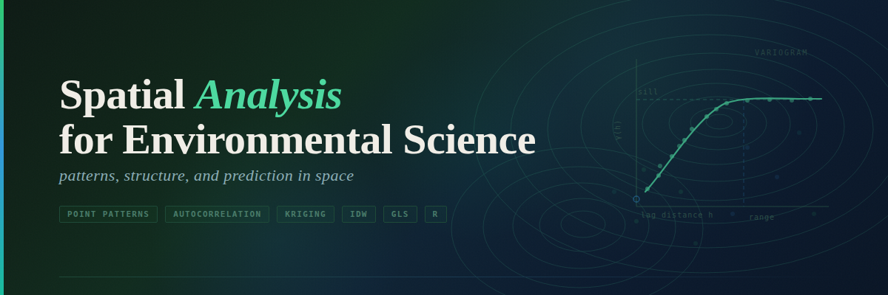

--- 
title: "Spatial Analysis for Environmental Science"
subtitle: "Course Notes"
author: "Andy Bunn"
date: "`r format(Sys.time(), '%d-%B-%Y')`"
description: "Spatial analysis notes and exercises"
documentclass: book
bibliography: [packages.bib]
biblio-style: apalike
link-citations: yes
site: bookdown::bookdown_site
output: 
  bookdown::gitbook:
    css: style.css
    config:
      toc:
        collapse: section
        scroll_highlight: true
        before: null
        after: null
    split_bib: no
---



# Welcome

These are the course notes and not a textbook. They are more like a field guide written by someone who has gotten lost in these woods before and wants to help you find your way through.

The notes are hands-on by design. You will write code, look at data, make maps, fit models, and interpret results. Each section builds on what came before. The math shows up when it needs to, but the emphasis throughout is on doing spatial analysis and understanding what you're doing -- not on deriving things for their own sake.

I'll point you to textbooks and papers along the way. Read them. They complement what we're doing here and will matter when you're working on your own data and I'm not around to ask.

These notes are a living document. They change based on what works, what doesn't, and what you ask about in class. If something is wrong or unclear, tell me.

## What's in These Notes

The notes move through the core ideas of spatial analysis in roughly this order:

- **Introduction to Geospatial Concepts** *(Data Carpentry)* -- Before we can analyze spatial data, we need to be able to handle it. These workshops get you there. Think of it as building the workbench before we start making things.
- **An Aside: Methods and Generics in R** -- A quick look under the hood at how R uses generic functions. Knowing this will help you make sense of why `plot()` and `summary()` behave differently depending on what you give them.
- **Mt Baker Map** -- A practical introduction to raster and vector spatial data in R, using elevation and infrastructure data from a local ski area.
- **Point Patterns** -- How to quantify whether points in space are randomly distributed, clustered, or repulsed, using kernel density estimation and Ripley's K.
- **Intro to Autocorrelation** -- How to measure and describe spatial structure in a continuous variable using variograms, Moran's I, and correlograms.
- **Geostats I: Inverse Distance Weighting** -- Predicting values at unsampled locations using a deterministic, distance-weighted approach. Simple, intuitive, and a good place to start.
- **Geostats I: Thin-Plate Splines** -- A smooth, flexible interpolation method that minimizes curvature across the surface.
- **Geostats II: Kriging** -- The probabilistic workhorse of geostatistics. Kriging uses the spatial structure of the data to predict unknown values and -- unlike IDW -- gives you a real measure of uncertainty.
- **Geostats II: Regression Kriging** -- Kriging with external predictors folded in. Useful when you have covariates that explain part of the spatial pattern.
- **Regression: GLS with Autocorrelated Residuals** -- What to do when your regression residuals have spatial structure. Spoiler: you use GLS, and it works.

The asides are optional deep dives. They won't be on any assignment, but they're there if you want to understand what's happening under the hood.

Each chapter builds on the last, so working through them in order is recommended.

## Go Do Great Things

You are going to learn to see the world spatially. That sounds dramatic, but I mean it practically: by the end of this course you will be able to look at a dataset, ask where things are happening and why, and have real tools to answer those questions. That is not a small thing.

The people who do this work well are not necessarily the ones who find it easiest. They're the ones who run the code when it breaks, read the error messages, ask questions, and keep going. That's it. That's the whole secret.

So: set up your project, download the data, and let's get to work.

## Technical Setup

This document was written in Markdown using the **bookdown** package and built with **R version `r getRversion()`**. You should be reasonably up to date on your versions of R, RStudio, and relevant packages. You can update your packages by running:

``` r
update.packages()
```

### Project Structure

To follow along with the examples, you'll want a working RStudio project.

1.  **Create a new RStudio project**\
Go to **File → New Project → New Directory → New Project**. Give it a name (for example `spatial-course`) and choose where to save it.

2.  **Download the `data/` folder**\
The datasets used in the examples are available in the `data/` folder of the course repository. Download that folder and place it inside your project directory.

You can download the data directly from the GitHub [repo](https://github.com/AndyBunn/spatialNotes). The hard link to it is:
https://github.com/AndyBunn/spatialNotes/releases/download/data-latest/data.zip

Once it's unzipped your folder structure should look something like this:

   ```
   spatial-course/
   ├── data/
   │   ├── birdRichnessMexico.rds
   │   ├── mtbDEM.tif
   │   └── ...
   └── spatial-course.Rproj
   ```

3.  **Refer to data files using relative paths**

In your code, use paths like `"data/birdRichnessMexico.rds"` rather than full file paths. This keeps the code portable and ensures it will run on different machines without modification. E.g.,

```{r}
birdRichness <-  readRDS("data/birdRichnessMexico.rds")
```


4. **Save your Rmd files in the project root**

When you make a Rmd file for your work, save it in the project's root directory. For instance if you have the first two assignments saved in files called "MtBakerHomework.Rmd" and "pointPatternHomework.Rmd," your file and folder structure might look something like this:

   ```
   spatial-course/
   ├── data/
   │   ├── birdRichnessMexico.rds
   │   ├── mtbDEM.tif
   │   └── ...
   ├── MtBakerHomework.Rmd
   ├── pointPatternHomework.Rmd
   └── spatial-course.Rproj
   ```

```{r include=FALSE}
# automatically create a bib database for R packages
knitr::write_bib(c(
  .packages(), 'tidyverse', 'terra', 'sf', 'ggnewscale','tidyterra',
  'spatstat', 'ncf', 'spdep', 'gstat', 'tmap','nlme', 'fields', 'ggrepel'),
'packages.bib')
# to build everything in docs/.
# bookdown::render_book() 
# to build a chapter only
# bookdown::preview_chapter("03Point_Patterns.Rmd")
```
